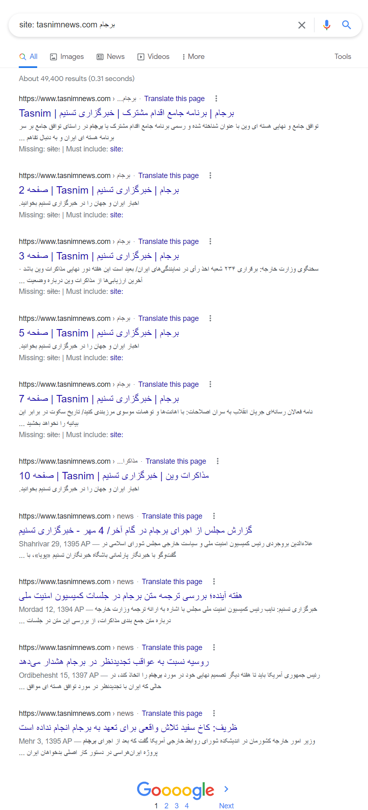

## تگ کنونیکال را به درستی به‌کار بگیرید

اگر با جست‌وجوی یک کلمه کلیدی دو یا چند صفحه از سایت ما در نتایج گوگل نمایش داده شود، ممکن است که با مشکلاتی رو به رو شویم. در برخی موارد این اتفاق شبیه به یک فاجعه است؛ زیرا صفحات ما در حال رقابت با یکدیگر هستند. Cannibalization یا هم‌نوع خواری می‌تواند تاثیر منفی روی جایگاه و رتبه بندی صفحات سایت ما بگذارد.

در اغلب موارد Cannibalization زمانی رخ می‌دهد که دو یا چند صفحه از سایت خبری برای یک کلمه کلیدی (مفهوم کلیدی) یکسان یا چند کلمه کلیدی بسیار مشابه و نزدیک به یکدیگر بهینه شده باشند. در این صورت گوگل نمی‌تواند تشخیص دهد که کدام یک از این صفحات پاسخ بهتری برای عبارت جست‌وجو شده ارائه می‌دهند و هر دو آن‌ها را در نتایج گوگل نمایش می‌دهد تا خود کاربر در این مورد تصمیم‌گیری کند.

مشکل اصلی این‌جاست که اگر هر دو صفحه ما دارای موضوع و هدف یکسان باشند، کاربران نیز متوجه تفاوت آن‌ها نخواهند شد به صورت تصادفی روی آن‌ها کلیک می‌کنند. این موضوع شانس کسب آمار کلیک بیشتر و جایگاه بهتر را از این صفحات می‌گیرد. به این ترتیب صفحات سایت ما در حال از بین بردن فرصت‌های رتبه گیری یکدیگر خواهند بود.

این مشکل در سایت‌های خبری بسیار زیاد است. زیرا ممکن است که اخبار در بازه‌های زمانی متفاوت بر روی یک مفهوم کلیدی تمرکز داشته باشند و مشکل کنیبالیزیشن ایجاد شود. اما چاره کار چیست؟ چگونه می‌توان این مشکل را تشخیص داد؟ و از آن مهم‌تر چگونه می‌توان این مشکل را برطرف کرد که برای جایگاه صفحه اصلی در نتایج موتور جست‌وجو مشکلی ایجاد نشود؟

استفاده از عملگر Site: می‌تواند به ما در تشخیص کنیبالیزیشن کمک می‌کند. برای استفاده از این تکنیک کافی است تا در نوار جست‌وجو گوگل کلمه کلیدی مدنظر را به صورت زیر وارد کنیم:

Site: [www.YourSite.com](http://www.YourSite.com) کلمه کلیدی

برای حل این مشکل چند روش پیش روی ما قرار دارد. تگ کنونیکال یکی از مهم‌ترین روش‌های این موضوع در کنار ویرایش محتوا، حذف صفحات غیرضروری و ریدایرکت 301 است. این تگ، معمولا به صورت rel="canonical" استفاده می‌شود. ‌تگ‌های کنونیکال، راهی هستند تا به موتورهای جست‌وجو بگوییم کدام URL مشخص، نسخه اصلی برای یک صفحه است. این تگ‌ها به شما امکان می‌دهند URL کنونیکال را برای یک صفحه مشخص کنید.

یک لینک کنونیکال به وب‎مسترها این امکان را می‌دهد تا با تعیین نسخه متعارف یا ترجیحی یک صفحه وب، از بروز مطالب تکراری جلوگیری کنند. این تگ در بخش \<head\> \</head\> از کد منبع HTML یک صفحه وب قرار می‌گیرد و به این شکل است:

\<link rel="canonical" href="https://www.YourSite.com/page/" /\>

این تگ یا می‌تواند خود ارجاعی باشد (جایی که تگ کانونیکال به URL خود صفحه اشاره دارد) یا می‌تواند برای ادغام سیگنال‌ها به URL صفحه دیگری ارجاع بدهد.
