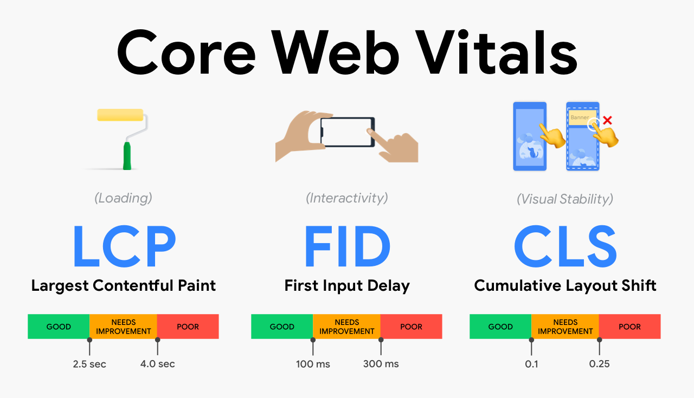

## به معیارهای CORE WEB VITALS توجه ویژه‌ای داشته باشید

کور وب ویتال، یک معیار سنجش تجربه صفحه از طرف گوگل برای تعیین نوع تجربه بازدیدکنندگان با ورود به صفحه شما است. به عنوان یک صاحب وب سایت، توسعه دهنده یا سازنده، شما ده‌ها فاکتور مختلف را در وب سایت خود در نظر می‌گیرید. اگر در حال حاضر روی سایت‌های جدید کار می‌کنید یا سایت‌های موجود را به‌روزرسانی می‌کنید، باید این سه عامل را برای آینده در ذهن داشته باشید.

-   **بارگذاری:**

Largest Contentful Paint یا LCP به عملکرد بارگذاری صفحه شما اشاره دارد. سرعت بارگذاری درک شده را پوشش می‌دهد، به این معنی که چقدر طول می کشد تا وب سایت شما شروع به نمایش عناصر مهم برای کاربر کند. معیار کلی برای گوگل 2.5 ثانیه است. این بدان معناست که وب سایت شما باید همه چیز را در فریم اول در 2.5 ثانیه نمایش دهد تا به صورت ایده‌آل باشد.

به خاطر داشته باشید که صفحات وب به صورت مرحله‌ای نمایش داده می‌شوند. بنابراین هنگامی که عناصر نهایی بالای صفحه شما بارگذاری می‌شود، LCP شما خواهد بود. LCP آهسته، رتبه‌ی شما را پایین می آورد و LCP سریع، رتبه‌های بالاتری را برای شما به ارمغان می‌آورد.

-   **تعامل:**

First Input Delay یا FID پاسخگویی صفحه وب شما است. این معیار، زمان بین اولین تعامل کاربر با صفحه و زمانی که مرورگر می‌تواند به آن تعامل پاسخ دهد را اندازه‌گیری می‌کند. معیار کلی برای گوگل 100 میلی ثانیه است.

فرض کنید در حال پر کردن فرمی برای عضویت در خبرنامه یک وب سایت برای درخواست اطلاعات بیشتر در مورد اخبار داغ و جذاب هستید. شما فرم را پر کرده و روی ارسال کلیک کنید. چه مدت طول می‌کشد تا وب سایت پردازش آن درخواست را آغاز کند؟ این زمان، همان First Input Delay است. به عبارت دیگر، زمان بین اقدام کاربر و پاسخ وب را FID نامگذاری می‌کنند. کوتاه بودن زمان FID برای کاربران بسیار مهم است.

-   **پایداری بصری:**

CLS یاCumulative Layout Shift به فراوانی تغییرات طرح‌بندی غیرمنتظره و ثبات بصری کلی صفحه وب اشاره دارد.

فرض کنید در حال خواندن محتوای اخبار یک سایت خبری هستید که یک چیز جالب می بینید. سعی می‌کنید که روی آن کلیک کنید اما درست در آخرین لحظه، پایین می‌رود. اکنون باید به عقب برگردید و آنچه را که به دنبال آن بودید دوباره پیدا کنید. شما در حال خواندن یک پاراگراف هستید یا یک چیز جالب دیده‌اید که می‌خواهید روی آن کلیک کنید اما دکمه‌ها، تبلیغات و ویدیوها همچنان در حال بارگذاری هستند و مدام پاراگراف را در صفحه پایین می‌آورد، بنابراین برای خواندن آن باید دائما به پیمایش ادامه دهید.

اینها نشانه‌هایی از تجربه ضعیف در صفحه هستند، و گوگل در تلاش برای ارائه بهترین تجربه برای کاربران این مشکلات را فاکتور بررسی قرار می‌دهد.
