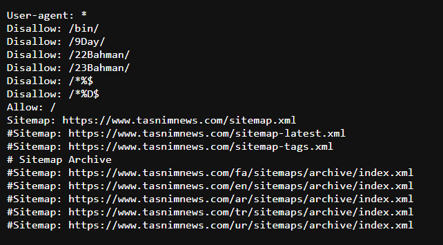

## برای بهینه‌سازی بودجه خزش از Robots.txt و متاتگ robot استفاده کنید

ربات‌های موتورهای جست‌وجو پررنگ‌ترین نقش ممکن برای معرفی کامل یک سایت به موتورهای جست‌وجو را ایفا می‌کنند. گوگل به عنوان بزرگترین مرجع و گسترده‌ترین شبکه در این زمینه، ربات‌های اختصاصی و عمومی زیادی گسترش داده است. وب‌مسترهای موفق همواره عملکرد و تغییرات این ربات‌ها را دنبال کرده و مطابق با استانداردهای آنان پیشروی می‌کنند.

یک Robots.txt درواقع یک فایل متنی ساده است که در مسیر اصلی فضای سایت شما یاRoot Directory قرار می‌گیرد. در حقیقت وظیفه این فایل معرفی بخش‌های قابل دسترسی و بخش‌های محدود شده برای دسترسی ربات‌ها یا با تعریفی دقیق‌تر، خزندگان سطح وب که از سوی موتورهای جست‌وجو به منظور بررسی و ثبت اطلاعات سایت‌ها ایجاد شده اند می‌باشد.

با درج دستوراتی خاص در این فایل، شما می‌توانید به ربات‌های موتورهای جست‌وجو بگوئید که کدام صفحات، کدام فایل‌ها و کدام بخش‌های سایت شما را دیده و آن‌ها را ایندکس کنند و کدام صفحات را نادیده بگیرند. به عبارت دیگر، اولین چیزی که ربات‌های موتورهای جست‌وجو با آن برخورد می‌کنند، همین فایل Robots.txt است. به محض رویارویی با این فایل، خزندگان سطح وب شروع به بررسی محتوا و لیست داخل این فایل کرده تا بخش‌های قابل دسترسی را پیدا کنند.

همانطور که گفته شد، این فایل باید در روت اصلی هاست شما قرار بگیرد. در این حالت آدرس دسترسی به این فایل به صورت زیر خواهد بود :

[www.YourWebsite.com/robots.txt](http://www.YourWebsite.com/robots.txt)

در کل ۴ دستور مهم در فایل Robots.txt نیاز داریم:

-   User-agent: برای مشخص کردن رباتی که دستورات برای آن نوشته شده.
-   Disallow: بخش‌هایی که ربات اجازه درخواست یا بررسی آن را ندارد.
-   Allow: بخش‌هایی که مجاز به درخواست و بررسی است.
-   Sitemap: برای نشان دادن آدرس فایل نقشه سایت به ربات‌ها.

Meta Robots یک تگ HTML است که در قسمت هدر صفحه قرار می‌گیرد. متاتگ Robots هم عملکرد مشابهی دارد و می‌تواند دسترسی‌های ربات‌های گوناگون را محدود کند؛ اما با این تفاوت که شما قابلیت مانوور بیشتری دارید، یعنی با این متا تگ دیگر کل صفحه را محدود نمی‌کنید بلکه می‌توانید المان‌های داخل صفحه مانند یک تصویر یا یک ویدیو را محدود کنید. این موضوع جزئی‌تر است و شما می‌توانید در صورت نیاز دقیق‌تر عمل کنید.

-   Index: به موتورهای جست‌وجوگر مثل گوگل اجازه می‌دهد که صفحه را ایندکس کنند.
-   Noindex: به موتورهای جست‌وجوگر اجازه ایندکس کردن را نمی‌دهد و این صفحه در نتایج جست‌وجو نمایش داده نمی‌شود.
-   Follow: با این دستور موتورهای جست‌وجوگر می‌توانند لینک‌های درون صفحه را دنبال کنند و به آن‌ها ارزش دهند.
-   Nofollow: با این دستور موتورهای جست‌وجوگر نمی‌توانند لینک‌های درون صفحه را دنبال کنند و به آن‎‌ها ارزش دهند.
-   All: کد کوتاه برای استفاده از دستور index و follow به صورت همزمان
-   None: کد کوتاه برای استفاده از دستور noindex و nofollow به صورت همزمان
-   Noimageindex: از ایندکس شدن تصاویر یک صفحه جلوگیری می‌کند.
-   Noarchive: موتورهای جست‌وجوگر نباید صفحات ذخیره شده در حافظه کش را نمایش دهند.
-   Nocache: مثل Noarchive می‎‌باشد، اما صرفا توسط مرورگر Internet Explorer و Firefox کار می‎‎‎‌کند.
-   Nosnippet: به موتورهای جست‌وجوگر گفته می‎‌شود که قطعه‎‎‌ای از این صفحه (توضیحات متا) را در صفحه نتایج موتور جست‌وجو نشان ندهند.
-   Nositelinkssearchbox: از نمایش کادر جست‌وجو در صفحه نتایج موتور جست‌وجو توسط موتورهای جست‌وجوگر مثل گوگل جلوگیری می‌کند.
-   Nopagereadaloud: جلوگیری از خواندن اطلاعات صفحه توسط ابزارهای صوتی و جلوگیری از نمایش صفحه در جست‌وجوهای صوتی
-   Notranslate: موتورهای جست‌وجو نمی‎‎‌توانند اطلاعات ترجمه شده از صفحه را در صفحه نتایج موتور جست‌وجو نمایش دهند.
-   max-snippet: با استفاده از این دستور می‌توانید حداکثر تعداد کاراکترهای توضیحات متا را مشخص کنید.
-   max-video-preview: حداکثر زمان یک ویدئو (به ثانیه) را برای پیش‌نمایش مشخص می‎‎‌کند.
-   Rating: به موتورهای جست‌وجوگر نشان می‎‎‎‌دهد که محتوای صفحه برای بزرگسالان مناسب است.
-   unavailable_after: برای موتورهای جست‌وجوگر مشخص می‎‌کند که پس از یک تاریخ و زمان، صفحه را ایندکس نکنند.

### چرا باید از Robots.txt استفاده کنیم؟

محدود کردن دسترسی خزندگان موتورهای جست‌وجو به صفحات، فایل‌ها و محتوای انتخابی سایت‌ها رایج‌ترین دلیل استفاده از فایل robots.txt است. اگر برای شما این سؤال پیش آمده است که چرا باید بعضی از صفحات یا فایل‌ها را ایندکس نکنیم، در جواب باید گفت که در بسیاری از موارد، ایندکس شدن و معرفی شدن یک صفحه یا فایل از یک سایت در موتورهای جست‌وجو می‌تواند نتایج نامناسبی به همراه داشته باشد.

به عنوان مثال شاید یک وب‌مستر قصد انتشار مطلبی خاص را داشته باشد که مخاطبین آن مطلب نیز افرادی خاص و منتخب هستند. این مطلب ممکن است از لحاظ بعضی شرایطی، برخی از قوانین موتورهای جست‌وجو را نقض کند و یا شامل محتوایی باشد که امکان معرفی آن به صورت عمومی وجود نداشته باشد. در این صورت می‌توان با کمک فایل Robots.txt دسترسی موتورهای جست‌وجو به این صفحات یا فایل‌ها را محدود کرد.

از طرفی وب‌سایت‌های فعال به ویژه وب‌سایت‌های پربازدید و بزرگ، روزانه هزاران بار توسط ربات‌های گوناگون از سمت موتورهای جست‌وجو مورد بازدید و بررسی قرار می‌گیرند. هر ربات طی یک فرآیند دو مرحله‌ای (بررسی و سپس ایندکس) اقدام به جمع‌آوری اطلاعات از سایت‌ها می‌کند. این فرآیند شامل بررسی تمام بخش‌های سایت شما است. حالا فرض کنید به صورت روزانه صدها یا هزاران ربات شروع به بررسی و جمع‌آوری اطلاعات از سایت شما می‌کنند و در این صورت، عملکرد بهینه سایت شما و سرعت بارگذاری اطلاعات آن برای مرورگرها تحت‌الشعاع قرار خواهد گرفت.

بدیهی‌ست که رفت و آمد این حجم از ربات‌ها می‌تواند تا حد قابل توجهی بازدهی کلی سایت را با شرایط نامناسبی همراه کند. البته اگرچه این موضوع برای سایت‌هایی که بازدید کمتری دارند بسیار کمتر به چشم می‌آید اما برای سایت‌های پربازدید که به خودی خود باید روزانه ترافیک بازدید از سمت هزاران کاربر را هندل کنند، اضافه شدن ترافیک زیاد این ربات‌ها نیز ممکن است دردسرساز باشد.

در این مواقع اغلب وب‌مسترها به راحتی و با استفاده از robots.txt دسترسی ربات‌های موتورهای جست‌وجو را به بخش‌های مختلف و مشخص شده‌ای که اهمیت چندانی برای سئو و کسب رتبه در موتورهای جست‌وجو ندارند را محدود می‌کنند. در این حالت نه تنها سرور سایت با ترافیک سبک‌تری فعالیت خواهد کرد، بلکه مراحل بررسی و جمع‌آوری اطلاعات و سپس ایندکس کردن آن‌ها توسط ربات‌ها نیز به مقدار بسیار زیادی سریع‌تر خواهد شد.

در نهایت هرچه تعداد صفحات وبسایت شما بیشتر باشد، ربات‌های موتور جست‌وجو زمان بیشتری برای خزیدن و ایندکس کردن صفحات نیاز دارد. همین زمان طولانی، روی رتبه سایت‌تان در نتایج جست‌وجو، تاثیر منفی خواهد گذاشت. چون ربات خزنده موتور جست‌وجوی گوگل دارای ویژگی به نام Crawl Budget یا بودجه خزش است.

بودجه خزش در حقیقت تعداد صفحاتی از وب سایت‎تان است که ربات گوگل در یک روز آنها را خزیده و بررسی می‌کند. بودجه شما، یا همان تعداد صفحاتی که توسط Googlebot مشاهده می شوند، بر اساس حجم وب‌سایت شما (تعداد صفحات)، سلامت آن (عدم بروز خطا) و تعداد بک‌لینک‌های سایت‌تان تعیین می‌شود و محدود است.

پس در سایت‌های خبری باید توجه ویژه‌ای به این موضوع داشته باشید و صفحاتی که هدف شما نیستند و نیاز چندانی به آن‌ها ندارید را با استفاده از Robots.txt محدود کنید. به این صورت بودجه خزشی که به شما اختصاص می‌یابد صرف رسیدگی به صفحات هدف و مهم سایت شما می‌شود و اطمینان پیدا می‌کنید که نتایج مناسبی حاصل می‌شود.
