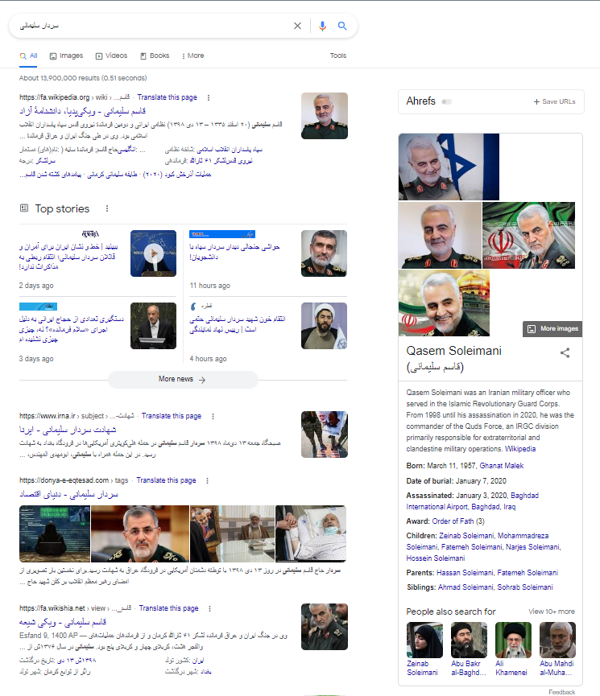

## از کدهای نشانه‌گذاری متناسب با نیاز صفحات استفاده کنید

**اسکیما** یا همان **Schema Markup** در اصل زبان نشانه‌گذاری سایت است. به زبان ساده باید گفت که قرار است این زبان کدگذاری و نشانه گذاری اسکیما از طریق یکسری دستورالعمل‎‌ها و کدهای از پیش تعریف شده (ساختار یافته)، وب سایت را موثرتر به گوگل معرفی کند.

مشخصاتی مانند هدف، محتوا، نویسنده، رویدادها و غیره در مورد سایت شما توسط کدهای نشانه‌گذاری به موتورهای جست‌وجوی گوگل، بینگ، یاهو و ... معرفی می‌شوند. از این طریق موتور جست‌وجوی گوگل بهتر و راحت‌تر با سایت و محتوای آن ارتباط برقرار می‌کند و این ممکن است به رسیدن صفحات وب سایت در نتایج برتر موتور جست‌وجو کمک کند.

اسکیما وظیفه استاندارد سازی و یکپارچه سازی زبان نشانه گذاری را بر عهده دارد. این نشانه ها به گونه‌ای توسعه داده شده‌اند، که بیشتر موتورهای جست‌وجو آنها را درک کنند. موتورهای جست‌وجو با خواندن این نشانه‌ها می‌توانند، همه موارد مهم در مورد یک سایت یا صفحه را دریابند. از اسکیما به عنوان نشانه گذاری معنایی نیز یاد می شود. این نوع نشانه گذاری سبب می شود، تا اطلاعات مفید و بیشتری در کنار نتایج سایت شما به کاربران نشان داده شود. تجربه نشان داده که با کمک این اطلاعات اضافه، شانس کلیک خوردن سایت حدودا 30 درصد افزایش می یابد.

پس نشانه‌گذاری اسکیما به موتورهای جست‌وجو کمک می‌کند تا اطلاعات بیشتری راجع به محتوای صفحه به دست آورند. برای مثال با اسکیما می‌توانید به گوگل بگویید که در این صفحه مقاله‌ای درباره یک "سردار" با عنوان "قاسم سلیمانی" نوشته "کورش اسدی" داریم که کاربران "امتیاز" 4 از 5 را به آن داده‌اند. حتی سایر اطلاعات را می‌توانید به صورت دقیق ذکر کنید تا موتورهای جست‌وجو از آن استفاده کنند.

برای نمونه به تصویر زیر دقت کنید. پس از جست‌وجوی نام سردار سلیمانی در گوگل به بخش سمت راست صفحه می‌رسیم که حاصل اطلاعات بدست آمده از همین اسکیماها و کدهای نشانه‌گذاری است. اطلاعاتی که شامل مشخصات، تاریخ تولد، تاریخ شهادت، نام پدر و مادر و ... است.

در سال 2011 بود که وب‌سایت Schema.org، یک همکاری تجاری را با موتورهای جست‌وجوی گوگل، بینگ و یاهو شروع کرد و وظیفۀ یکپارچه‌سازی ساختار داده‌های موجود در سطح اینترنت را بر عهده گرفت. در واقع schema.org دایره‌المعارفی از آیتم‌های نشانه‌گذاری است و زبانی استاندارد و قابل فهم را برای موتورهای جست‌وجو ارائه داده است.

موتورهای جست‌وجو بر اساس آیتم‌های تعریف شده در این سایت داده‌ها را طبقه‌بندی کرده، ساختار آن‌ها را بررسی می‌کنند و از آن‌ها برای رتبه‌بندی سایت‌ها استفاده می‌کنند. در نهایت انواع مختلف کدهای اسکیما و دستورالعمل نحوه به کارگیری آن‎‌ها را می توانید در سایت schema.org به طور کامل مشاهده کنید.
