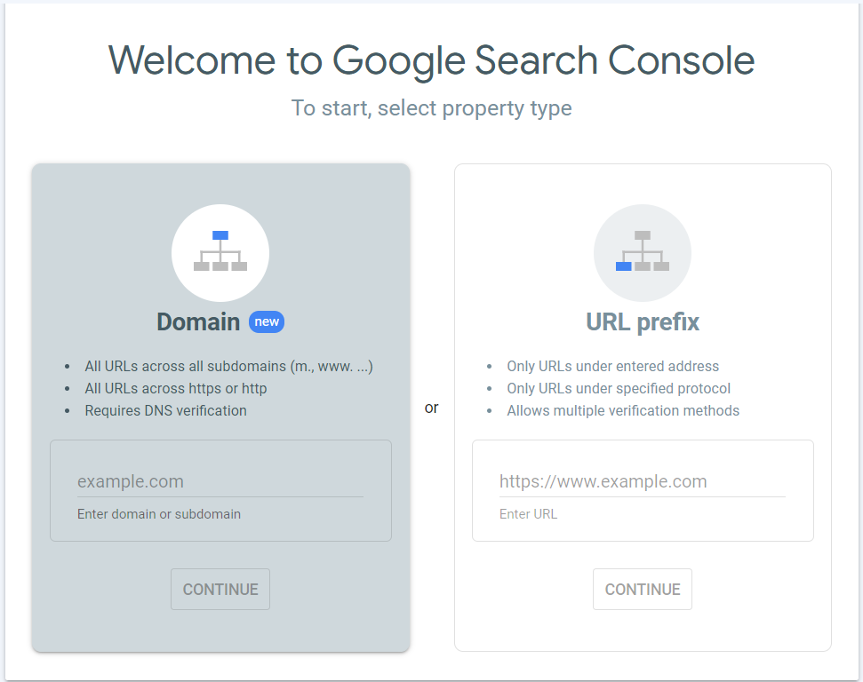

## سایت را به گوگل و سایر موتورهای جست‌وجو معرفی کنید

به منظور بهبود سئو و بهینه سازی سایت در موتورهای جست‌وجو باید سایت خود را در موتورهای جست‌وجو از جمله گوگل، بینگ، یاهو و... ثبت کنید. ثبت سایت در موتورهای جست‌وجو باعث دیده شدن سایت شما در فضای وب می شود.

هر کدام از موتورهای جست‌وجو پنل خاص خود را دارند که با ثبت سایت، فرآیند ردیابی کاربران آغاز می‌شود و اطلاعات بدست آمده از آن در این پنل ثبت می‌گردد. شما می‌توانید از این پنل برای سنجش عملکرد خودتان در زمینه سئو استفاده کنید و دائما بازخورد دریافت کنید و فعالیت‌های خود را بهینه‌سازی کنید. اما چطور باید یک وب‌سایت را در موتور جست‌وجویی همچون گوگل ثبت کرد؟

سرچ کنسول گوگل یک نرم افراز رایگان می‌باشد که توسط شرکت گوگل در اختیار افراد قرار گرفته است. به کمک این سرویس می‌توانید به مجموعه اطلاعاتی دست پیدا کنید که هیچ سرویس دیگری در اختیار شما قرار نمی‌دهد. در ابتدا باید به آدرس اینترنتی زیر مراجعه کنید. سپس بعد از انتخاب گزینه شروع با صفحه‌ای که در تصویر زیر آمده است رو به رو می‌شوید.

<https://search.google.com/search-console/about>

در این بخش دو انتخاب پیش روی شماست. در حالت اول باید در کادر قرار گرفته در بخش URL prefix آدرس سایت خود را وارد نمایید. سپس روی دکمه Continue کلیک کنید. در نظر داشته باشید که باید آدرس سایت خود را به صورت کامل و به حالت http://YourSite.com وارد نمایید. بدین ترتیب تنها URL وارد شده تحت پروتکل مشخص شده ثبت می شود. در نتیجه شما باید برای اضافه کردن زیردامنه‌ها یا پروتکل‌های دیگر به صورت جداگانه اقدام نمایید.

در حالت دوم نیز دوباره نام دامنه خود را در باکس قرار گرفته در بخش Domain وارد کرده و سپس روی دکمه Continue کلیک می‌کنید. در این روش دیگر نیازی به افزودن زیردامنه‌های دیگر سایت یا پروتکل‌های دیگر نمی‌باشد. در زمان ثبت سایت در کنسول گوگل از این طریق تمامی این زیر دامنه‌ها یا پروتکل‌ها نیز برای شما در نظر گرفته می‌شود. در نتیجه شما باید آدرس سایت خود را به صورت YourSite.com وارد نمایید. برای ثبت مالکیت از این طریق باید از DNS record استفاده شود.

پیشنهاد می‌شود از حالت دوم استفاده کنید و سپس به منظور ثبت مالکیت از این طریق باید یک DNS record به نام هاستینگ خود اضافه نمایید. بدین منظور باید وارد کنترل پنل هاست خود شده و همانند روش قبل TXT record را کپی و در DNS configuration اضافه نمایید. در آخر نیز به صفحه فعلی برگشته و روی دکمه Verify کلیک کنید.

گوگل این رکورد را تشخیص می‌دهد و متوجه می‌شود که record شخصی شما وجود داشته و به دامنه شما اختصاص پیدا کرده است. نکته‌ای که باید به آن توجه داشته باشید این است که زمان تایید شدن در این روش ممکن است در مقایسه با روش های قبلی کمی طولانی‌تر باشد. چرا که شما تمامی زیردامنه‌ها و پروتکل‌های دیگر سایت خود را نیز به صورت همزمان اضافه می‌کنید.

بعد از طی نمودن مراحل قبلی و تایید مالکیت سایت یا اپلیکیشن، می‌توانید وارد گوگل سرچ کنسول شده و از خدمات ارائه شده در آن بهره ببرید. به خاطر داشته باشید که جمع‌آوری اطلاعات وب سایت شما و نمایش آن‌ها کمی زمان بر است. به همین دلیل برای مشاهده اطلاعات دقیق خود باید کمی منتظر بمانید و صبور باشید.

دیگر موتورهای جست‌وجو نیز فرآیندی مشابه دارند که طی آن دسترسی به پنل تحلیلی را برای شما فراهم می‌کنند.
