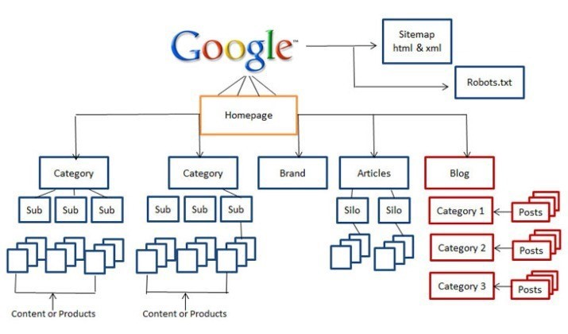
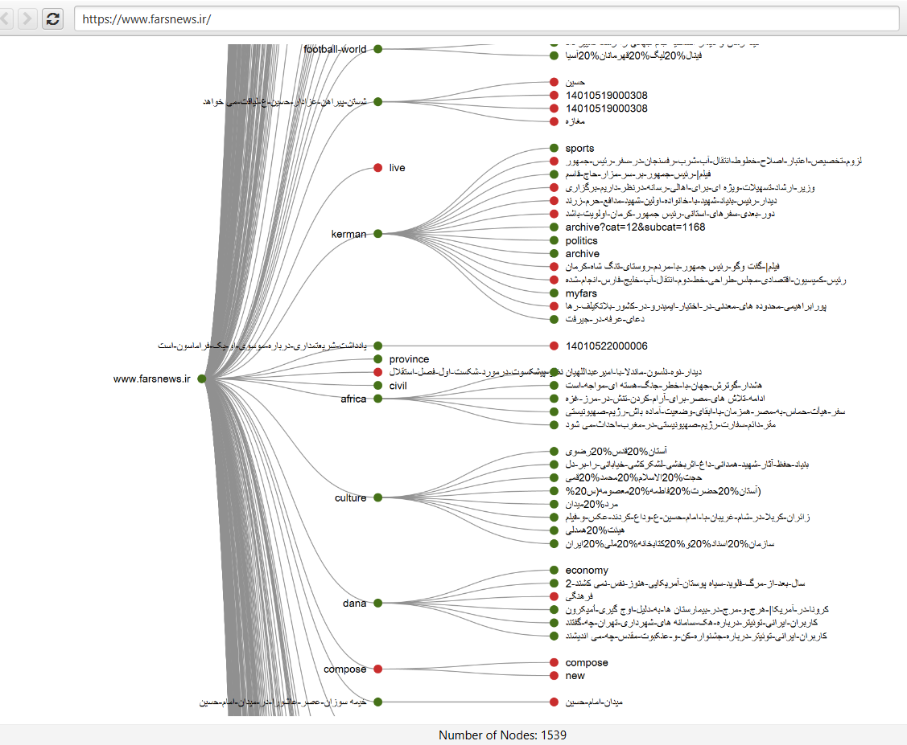

## ساختار سایت را بر مبنای استراتژی SILO بچینید

**ساختار سیلو** در **سئو** نوعی معماری وب سایت است که در آن محتوایی را در مورد یک موضوع خاص گروه‌بندی، جداسازی و **لینک سازی داخلی** انجام می‌دهید. این کار باعث ایجاد بخش‌های جداگانه و متمایز از محتوای مرتبط به هم در وب سایت می شود.

می‌بینید که هر سیلو از یک صفحه سیلو اصلی و محتوای مرتبط تشکیل شده است که همه آنها به هم مرتبط هستند. با این حال این یک نکته بسیار مهم است که محتوای یک سیلو به محتوای سیلوی دیگر لینک نمی‌شود. به همین دلیل است که به آن ساختار سیلو می گویند، زیرا محتوا به معنای واقعی کلمه در سیلوها به صورت جداگانه قرار گرفته است.

به عنوان مثال وقتی سایت خبرگزاری فارس را در این زمینه بررسی می‌کنیم متوجه می‌شویم که گسترش حجم مطالب و محتوا باعث شده است که ساختار مشخصی در سایت وجود نداشته باشد. اگر چه برخی از بخش‌ها هدفمند و ساختاریافته هستند، اما در در دید کلی ساختار خطی است و مانند ساختار سیلوها، سلسله مراتب خاصی وجود ندارد.

دقت داشته باشید که وقتی ساختار سیلوها در یک وب سایت رعایت می‌شود، دستاوردهای زیر حاصل می‌گردد:

-   **موتورهای جست‌وجویی همچون گوگل راحت‌تر و سریع‌تر می‌توانند بخش‌های مختلف وبسایت شما را از یکدیگر تفکیک کنند، فرآیند خزش را شروع کنند و صفحات جدید را کشف کرده و ایندکس کنند. این موضوع می‌تواند تاثیر فوق‌العاده‌ای بر سئو سایت شما داشته باشد و رتبه ان را در صفحات نتایج موتور جست‌وجو به میزان چشمگیری افزایش دهد.**
-   **ساختار هدفمند و سلسله مراتبی باعث تاثیرگذاری بر روی الگوریتم Page Rank می‌شود. در واقع بخش‌های متمایزی که هر کدام مفهوم خاصی را پوشش می‌دهند، لینک‌سازی داخلی منظم و پیوستگی مفهومی را دارند، از ارزش بالاتری برای این الگوریتم برخوردارند. این الگوریتم فرمولی است که گوگل برای امتیازدهی به ارزش یک صفحه بر اساس کمیت و کیفیت صفحات لینک شده به آن استفاده می‌کند.**
-   **پیوستگی مفهومی و لینک‌سازی داخلی خوب علاوه بر موارد گفته شده بر روی تجربه کاربری نیز تاثیرگذار است. در واقع شما با این کار کاربر را در بستری از موضوعات بهم پیوسته قرار می‌دهید که از یکی محتوا به محتوای دیگر هدایت شود و این موضوع بر روی زمان صرف شده توسط کاربر در وب‌سایت شما (یکی از مهم‌ترین معیارهای سئو) تاثیرگذار است.**

در نهایت دقت داشته باشید که موضوعات هر یک از سیلوها باید هدفمند انتخاب شود. یعنی خود آن موضوعات نیز پتانسیل بالایی برای کسب جایگاه در صفحات نتایج داشته باشند. برای این کار نیاز به فرآیند تحقیق کلمات کلیدی و تعیین استراتژی وجود دارد که در بخش سئو داخلی مفصل راجع به آن صحبت خواهیم کرد.
