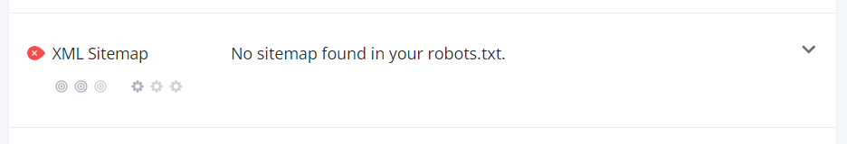

## سایت مپ XML را ایجاد کرده و به موتور جست‌وجو معرفی کنید

به عبارت ساده نقشه سایت XML لیستی از تمام صفحات سایت شما است. این یک نقشه راه برای موتورهای جست‌وجو در سایت شما است. با استفاده از آن، شما مطمئن خواهید شد که موتورهای جست‌وجو محتوای مهم سایت شما را از دست نخواهند داد.

درون نقشه سایت XML اغلب پست‌ها، صفحات، برچسب‌ها یا سایر پست‌های سفارشی طبقه‌بندی می‌شود. همچنین این نقشه شامل تعداد تصاویر و آخرین تاریخ اصلاح شده برای هر صفحه است. دقت داشته باشید که سایت مپ به تنهایی باعث رشد سئو نمی‌شود. بلکه باعث می‌شود که موتورهای جست‌وجو راحت‌تر و سریع‌تر محتوای سایت شما را درک کرده و ایندکس کنند.

موتورهای جست‌وجو از نقشه سایت XML استفاده می‌کنند تا ساختار سایت‌ها را یاد بگیرند. باید به خاطر داشته باشید که قرار دادن URL صفحات سایت در سایت مپ، ایندکس شدن سایت را تضمین می‌کند.

- تصویر مربوط به عدم استفاده سایت ایسنا از نقشه سایت

- تصویر مربوط به نقشه سایت بهینه سازی شده در سایت خبرگزاری تسنیم

این موضوع به این معنی است که اگر نقشه سایتی از کدهای XML خوب استفاده کند، آدرس‌های معتبر و مرتبی را برای کراولرها فراهم کند و سایر نیازمندی‌های موتورهای جست‌وجوگر را برآورده سازد، URL‌های موجود در آن در Crawl‌های بعدی مورد توجه قرار خواهند گرفت. همین امر شانس دیده شدن صفحات مختلف در موتورهای جست‌وجوگر را افزایش می‌دهد.
