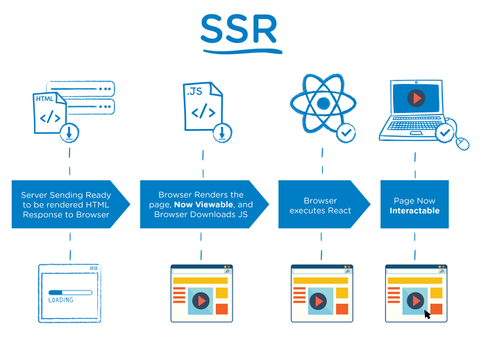

## SSR را فراموش نکنید!

اگر از تکنولوژی‌های جدید جاوااسکریپتی برای توسعه وب‌سایت استفاده می‌کنید، دقت داشته باشید که متاسفانه هنوز خزنده ‌های موتورهای جست‌وجو درک درستی از جاوااسکریپت ندارند و این بدان معناست که آن‌ها صفحات رندر شده در سمت کاربر مانند اپ‌های معمول react را به شکل صفحه‌ای خالی می‌بینند؛ و به همین دلیل است که ما باید از سرور ساید رندرنیگ استفاده کنیم؛ مخصوصا برای لندینگ پیج‌ها یا بلاگ‌ها.

در client-side rendering یا همان رندر سمت کاربر، مرورگر شما صفحه‌ی مینیمال ‌HTML ای را دانبارگذاری خواهد کرد و سپس جاوا اسکریپت به کامل کردن محتوای صفحه می‌پردازد. اما در server-side rendering یا همان رندر سمت سرور، کامپوننت‌های ری‌اکت در سرور رندر خواهند شد و خروجی نهایی HTML ای به کاربر ارسال می‌شود.

یعنی هنگامی که یک مرورگر یک صفحه وب SSR درخواست می کند، مرورگر یک صفحه وب HTML کاملا تشکیل شده با اجزای HTML به صورت pre-built دریافت می‌کند. سپس تمام کاری که مرورگر باید انجام دهد این است که این HTML را برای تولید HTML DOM و نمایش صفحه وب تجزیه کند. از دیدگاه موتورهای جست‌وجو، رندر سمت سرور دومین گزینه عالی برای رندرینگ جاوااسکریپت است.

بزرگترین مزیت این است که صفحات می‌توانند با سرعت خوبی رندر شوند. هرچه موتورهای جست‌وجو سریع‌تر بتوانند صفحات شما را مشاهده کنند، سریع‌تر می‌توانند به صفحه بعدی رفته و بودجه خزیدن شما را بهبود بخشند. نه تنها بودجه خزیدن شما بهبود می‌یابد، بلکه تجربه کاربری شما نیز بهبود می‌یابد.

یکی دیگر از مزایای SSR این است که می توانید اطمینان حاصل کنید که تمام عناصر صفحه شما رندر می‌شوند. وقتی تنها به یک مرورگر تکیه می‌کنید، به فناوری آن‌ها وابسته می‌شوید. یک ماشین قدیمی که ممکن است نتواند منابع بزرگ را پردازش کند، می‌تواند منجر به رندر جزئی شود. این بدان معناست که عناصر یا اطلاعات مهم محتوایی ممکن است از دست رفته باشند و Google نمی‌تواند برای این عناصر به شما اعتبار بدهد.

همین موضوع یک تجربه کاربری بد برای شما ایجاد می‌کند. همچنین ممکن است بر توانایی موتورهای جست‌وجو برای رتبه‌بندی صفحاتی که اطلاعات مهمی ندارند تأثیر بگذارد. اما باید به این نکته اشاره کرد که سئو و رتبه بندی بهتر صفحه، از آنجایی که HTML به طور کامل در سمت سرور شکل می‌گیرد و خزنده‌های وب راحت‌تر می‌توانند صفحات HTML را فهرست کنند، بهبود می‌یابد.
