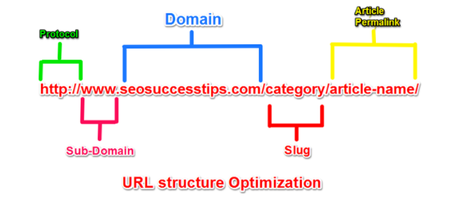

## به ساختار URLها رسیدگی کنید

نکات مربوط به ساختار URLهای یک وبسایت در واقع فوت کوزه‌گری سئو تکنیکال یک سایت هستند. شاید افراد غیر متخصص، در یک نگاه کلی چندان متوجه آدرس‌دهی در یک وبسایت نباشند. با این حال، فعالان و متخصصان حوزه سئو به‌خوبی می‌دانند که هدایت صحیح کاربر به نقاط مختلف وبسایت، تا چه اندازه سرنوشت‌ساز است.

پرچالش‌ترین قسمت URL هر سایت، Path یا مسیر آن است. Pathها مسیرهای داخلی یک سایت هستند که برای دسترسی بهتر، ایجاد ارتباط معنایی میان صفحات سایت و گروه‌بندی آن‌ها بکار می‌روند و بعد از آدرس دامنه می‌آیند. برای آنکه بتوانیم اطلاعات را به‌درستی جابجا کنیم یا بازدیدکنندگان سایتمان را در سریع‌ترین حالت ممکن به اطلاعات دلخواهشان برسانیم، استفاده صحیح از هر یک از این چهار عنصر، بسیار ضروری است. مثلاً برای دسته‌بندی اطلاعات، علاوه بر استفاده از فولدر، می‌توانیم از ساب‌دامین یا زیردامنه‌ها هم استفاده کنیم.

-   URLهای انگلیسی معنی دار مطابق با کلمه و مفهوم کلیدی صفحه مورد نظر را انتخاب کنید به نحوی که آدرس صفحه کاملا گویا و واضح باشد.
-   تا حد امکان آدرس صفحات را کوتاه در نظر بگیرید و از به کار بردن کلمات و اصطلاحات اضافی خودداری کنید.
-   برای بخش Path تماما از حروف کوچک انگلیسی استفاده کنید و برای جداسازی کلمات فقط از "-" استفاده کنید.
-   تا حد امکان از از تکرار کلمات پرهیز کنید چون تکرار هیچ فایده‌ای ندارد و صرفا تجربه کاربری بدی را ایجاد می‌کند.
-   لزومی ندارد که کلمات بکار رفته در آدرس نوشته با عنوان صفحه یکسان باشند، شما می‌توانید آدرس دهی را با کلمات دیگری انجام دهید.
-   تا حد امکان از کاراکترهای نامناسب مانند ?، & و % در آدرس سایت خود استفاده نکنید.
-   استفاده بیش از حد کلمات کلیدی در URL میتواند تاثیر معکوسی بر سئو شما داشته باشد.
-   از هشتگ‌ها در URL خود برای ایجاد محتوای جداگانه و منحصر به فرد اجتناب کنید.
-   پر کردن URL با کلمات کلیدی بی معنی است و موجب می شود سایت شما اسپم بنظر برسد.
