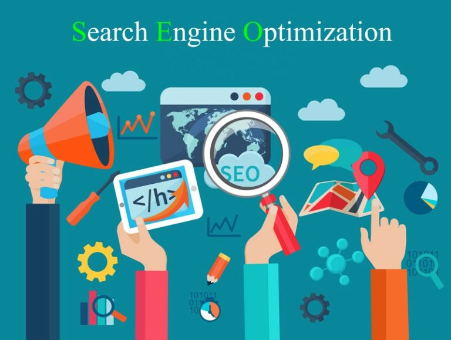

## سئو چیست؟

چرا بعضی از نتایج در صفحه اول و رتبه برتر هستند؟ و اینکه چطور موفق شدن بین صدها محتوای موجود در سطح وب، یک جایگاه خوب و برتر کسب کنند؟ چرا و چطور باید سایت مورد نظر را بهینه سازی کرد تا جایگاه بهتری کسب کند؟ جواب همه این سوالات به مفهوم سئو (بهینه‌سازی برای موتور‌های جست‌وجو) وابسته است.

واژه SEO مخفف کلمه Search Engine Optimization است، که مفهوم بهینه سازی سایت برای موتور‌های جست‌وجو شامل می‌شود. در واقع به مجموعه‌ای از اقدامات که باعث بهبود عملکرد یک وب سایت و رشد جایگاه آن در صفحات نتایج موتور‌های جست‌وجو می‌شود، سئو گفته می‌شود.

فرآیند سئو مجموعه‌ای از اقدامات است، که حاصل دانش، تجربه و مهارت خاصی است که برای بهینه سازی وب سایت و عملکرد آن در راستای کسب رضایت کاربر مورد استفاده قرار می‌گیرد. هم اکنون، هسته موتور جست‌وجو گوگل شامل بیش از ۲۰۰ فاکتور برای رتبه بندی صفحات وب سایت های گوناگون دارد.

اما نیاز به یادگیری تمام آنها نیست، بلکه در این بخش تجربه است که به کمک افراد می‌آید و با پیاده سازی و رعایت اساسی ترین معیار‌ها باعث کسب رتبه برتر در صفحه نتایج موتور جست‌وجو می گردد. نکته کلیدی که باید بدانید، این است که گوگل توجه و اهمیت بیشتری به وب سایت‌هایی دارد که برای کاربران بهینه شده‌اند، نه ربات‌های خزنده موتور جست‌وجو!

پس دقت داشته باشید که هرچه کاربران از بودن در یک صفحه لذت ببرند و زمان بیشتری را برای بررسی آن وب سایت صرف کنند، موتور جست‌وجو نیز این موضوع را به عنوان یک امتیاز مثبت برای آن وب سایت لحاظ می‌کند.

به چند دلیل رتبه‌های وب سایت‌ها در موتورهای جست‌وجویی همچون گوگل همواره تغییر می‌کند؛ اول اینکه در گذر زمان موارد فنی تغییر می‌کند و نیاز‌های جدید ایجاد می‌شود. به عنوان مثال شاید تا سال ۱۳۹۰ ، رسپانسیو (تطبیق پذیر) بودن سایت اهمیت چندانی نداشت. اما پس از اینکه تلفن‌های همراه بسیار پراستفاده شدند، گوگل برای جلب رضایت کاربران آنها، رسپانسیو بودن وبسایت را به عنوان یک فاکتور کلیدی در نظر گرفت!

مورد بعدی مربوط به الگوریتم‌های گوگل است که دائما در حال آپدیت شدن هستند. در واقع به مرور زمان درک موتور جست‌وجو نسبت به محتوا و نیاز کاربر بهتر شده است و این روند همچنان ادامه دارد. علاوه بر اینها در نظر داشته باشید که همواره رقبای جدیدی به چرخه رقابت وارد می‌شوند!

در نهایت باید بدانید که انتظارات کاربران از محتوا تغییر می کند. در نتیجه مدل جست‌وجوی آنان نیز متناسب با این موضوع تغییر خواهد کرد. پس سئو یک چرخه بی‌پایان و تکرار‌پذیر است و باید روند بهینه سازی سایت به صورت مداوم و متناوب انجام پذیرد.

## مهمترین مراحل سئو سایت

سئو و بهینه سازی یک وبسایت فرآیندی زمانبر، مستمر و تکرار پذیر است. ترفندها و روش‌های گوناگونی برای کسب جایگاه بهتر در نتایج موتورهای جست‌وجو وجود دارد، که هرکدام می‌تواند به اندازه خاصی تاثیر گذار باشد. اما اگر بخواهیم یک دید کلی نسبت به مفاهیم سئو داشته باشیم، باید سه زیرمجموعه اصلی آن را شناخته و تجزیه و تحلیل کنیم:

-   سئو داخلی
-   سئو تکنیکال
-   سئو خارجی
