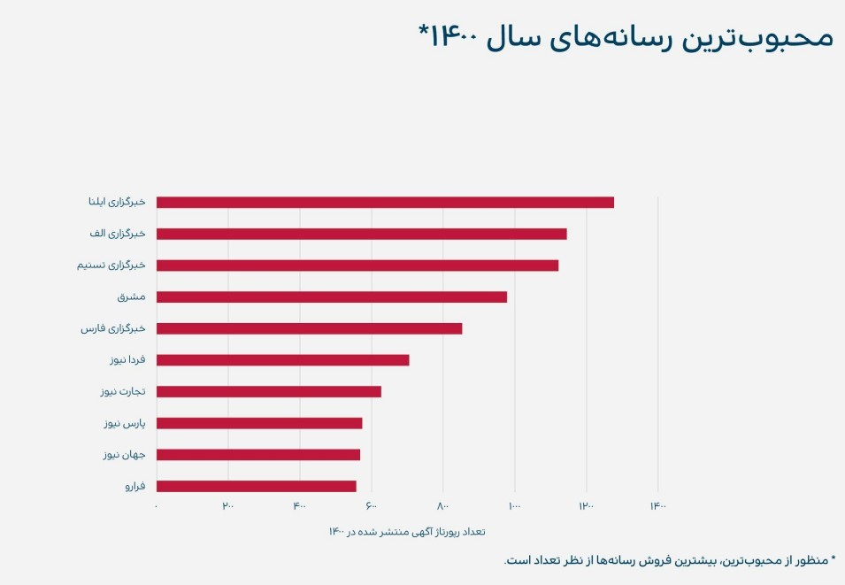

## لینک‌سازی خارجی

تمام بررسی‌های که روی فاکتورهای تاثیرگذار در سئو انجام شده نشان می‌دهد هنوز هم بک‌لینک قوی بیشترین تاثیر را در بهبود رتبه وبسایت‌ها دارد. البته این تاثیر نسبی است و به این معنی نیست که وبسایت بدون بک‌لینک نمی‌تواند رتبه خوبی در نتایج گوگل کسب کند.

در کل بک‌لینک‌ها به دلایل زیر اهمیت دارند:

-   گوگل با بک‌لینک در اینترنت اکتشاف می‌کند. ربات‌های گوگل از طریق لینک‌ها بین وبسایت‌ها می‌خزند و آنها را ایندکس می‌کنند.
-   شهرت، اعتبار، اقتدار و قابل اعتماد بودن وبسایت را نشان می‌دهد. گوگل از کیفیت و کمیت لینک‌ها این فاکتورها را اندازه می‌گیرد.
-   ارتباط وبسایت‌ها از بک‌لینک مشخص می‌شود. وبسایت‌هایی که از نظر محتوا یا کارکرد به هم ربط دارند پس به هم لینک می‌دهند. گوگل از این طریق متوجه ارتباط‌ها می‌شود.
-   انکرتکست‌ها اطلاعاتی درباره مقصد به گوگل می‌دهند.

این که چه سایتی به شما لینک می‌دهد مهم‌ترین شاخص در کیفیت بک‌لینک است. برای مثال، اگر یک وبسایت مهم دولتی با بازدید میلیونی بک‌لینک دهد تاثیر آن خیلی بیشتر از یک وبلاگ ناشناخته، بی‌محتوا و بدون بازدید‌کننده است.

این که چه وبسایتی بک‌لینک‌های قوی‌تری دارد بستگی به عوامل مختلفی از پسوند دامنه تا عواملی مثل شهرت و اعتبار دارد. نتایج بررسی داده‌های مربوط به تاثیر بک‌لینک‌ها نشان می‌دهد به طور کلی وبسایت‌های دولتی، دانشگاهی، مراکز و سازمان‌های مشهور، برندها و شرکت‌های بزرگ بک‌لینک‌های قوی‌تری دارند.

با این که وبسایت به تنهایی در کیفیت بک‌لینک تاثیرگذار است، اما خیلی وقت‌ها دیده می‌شود بک‌لینک صفحه‌ای از یک وبسایت نه چندان مشهور و مهم خیلی قوی‌تر تاثیر گذاشته است. دلیل این تاثیرگذاری بیشتر رتبۀ صفحه در کلیدواژه است. این صفحه با محتوای با کیفیت توانسته نیاز کاربران را برطرف کند. اگر از چنین صفحه‌ای بک‌لینک بگیرید تاثیر بیشتری خواهد داشت

یکی دیگر از معیارهای تاثیرگذار روش ایجاد بک لینک یا همان لینک‌سازی خارجی است. منظور از روش ایجاد بک لینک این است که کجا و چطور بک‌لینک بسازیم. ایجاد بک لینک یا بک‌لینک سازی انواع و نکات زیادی دارد. در سال‌های اخیر به روش‌های زیر بک‌لینک می‌سازند:

-   **بک‌لینک در رپورتاژ آگهی**

در روش رپورتاژ، مقاله‌ یا خبری را برای رپورتاژ دهنده می‌فرستید تا در وبسایتش منتشر کند. در میان این متن لینک‌هایی را مشخص می‌کنید. این روش بک‌لینک گرفتن بسیار متداول و بهترین روش است. با توجه به این که بک‌لینک با رپورتاژ تقریبا هیچ ضرری از نظر سئو ندارد و استفاده از این روش را گوگل غیرمستقیم تایید می‌کند، می‌توانید با این روش بک‌لینک‌های قوی و موثر بسازید.

محبوب‌ترین رسانه‌ها از نظر انتشار رپورتاژ آگهی مطابق آماری که پلتفرم تریبون منتشر کرده است:

-   **لینک‌سازی کامنتی**

لینک در نظرات یا همان کامنت روشی قدیمی اما همچنان کارساز است. البته به شرطی که به صورت دستی و هدفمند انجام شود، نه با ربات‌های درج کامنت انبوه! بعضی صفحه‌ها نظرات را بدون نیاز به تایید منتشر می‌کنند و اجازه می‌دهند لینک خود را قرار دهید. بعضی هم به صورت پیش‌فرض اگر لینکی در کامنت وجود داشته باشد آن را حذف می‌کنند.

لینک‌سازی در قسمت نظرات در کل توصیه نمی‌شود. لینک‌های قسمت نظرات بی‌تاثیر نیستند اما بی‌ضرر هم نیستند.

-   **راه‌اندازی شبکه‌ای از وبلاگ‌ها**

منتشر کننده‌های رپورتاژ برای این کار هزینه دریافت می‌کنند اما اگر بخواهید با هزینه مناسب‌تری و به صورت مدیریت شده بک‌لینک بسازید، می‌توانید وبلاگ یا حتی وبسایت خود را بسازید. اکثر سرویس‌های وبلاگ مانند بلاگفا، ویرگول، پرشین بلاگ و ... رایگان هستند و تنهای کاری که باید انجام دهید تولید محتوای مفید، مرتبط و با رعایت سئوی داخلی است. بعد می‌توانید به وبسایت خودتان بک‌لینک دهید.

با این که این روش موثر و کم هزینه است اما نداشتن محتوای مناسب، تعداد بیش از حد بک‌لینک در هر صفحه و زمانبندی نادرست در ایجاد بک‌لینک می‌تواند باعث شود گوگل به وبسایت شما شک کند. شک گوگل هم اگر زیاد شود منجر به جریمه یعنی سقوط رتبه در نتایج جست‌وجو خواهد شد.

پس دقت داشته باشید که این فرآیند باید برنامه‌ریزی شده باشد. شما می‌توانید فرآیند بک‌لینک‌سازی را لایه لایه پیش ببرید. به عنوان مثال برای بلاگ‌هایی که در این روش ایجاد می‌شوند و از اهمیت کمتری نسبت به سایت اصلی برخوردار هستند، از روش لینک‌سازی کامنتی استفاده کنید و سپس که اعتبار بلاگ‌ها بالاتر رفت، از آن‌ها برای لینک‌‌سازی محدود در راستای افزایش اعتبار سایت اصلی استفاده کنید.

-   **لینک‌سازی در هدر، فوتر، منو یا سایدبار‌های وبسایت**

در اکثر صفحه‌های هر وبسایت بخش‌هایی ثابت وجود دارند. برای مثال هدر (بالای صفحه)، فوتر (پایین صفحه) و ستون‌های کناری اکثر وبسایت‌ها دارای بخش‌های ثابتی در همه صفحات است.

اگر بک‌لینک در این بخش‌ها ایجاد شود یعنی به تعداد صفحات دارای این بخش تکراری بک‌لینک ساخته می‌شود. برای مثال، اگر وبسایتی ۵ هزار صفحه داشته باشد و تمام این صفحه‌ها فوتر یکسانی دارند، ایجاد بک‌لینک در فوتر همزمان باعث ایجاد ۵ هزار بک‌‌لینک می‌شود.

این روش چندان متداول نیست اما رعایت نکات مربوط به ارتباط محتوای دو وبسایت و تعداد یا تنوع هدف‌های بک‌لینک می‌تواند باعث افزایش تاثیر شود. پیشنهاد می‌شود این روش هم در لایه‌های اصلی به کار گرفته نشود و برای بخش‌هایی با ارزش کمتر همانند بلاگ‌ها استفاده شود.

-   **شبکه‌های اجتماعی و پروفایل‌ها**

اینستاگرام، توییتر، پینترست و دیگر انواع صفحه‌ها در شبکه‌های اجتماعی یک جایگاه لینک وبسایت دارند. هر کسب‌وکاری معمولا در این قسمت لینک صفحه اصلی وبسایت را درج می‌کند. هرچه صفحه فالوور بیشتری داشته و فعال‌تر باشد امکان این که از طرف گوگل به عنوان یک بک‌لینک قوی شناسایی شود بیشتر می‌شود.

برای ساخت رایگان سوشیال سیگنال کلاه سفید می‌توانید از روش های زیر استفاده کنید:

-   قرار دادن دکمه اشتراک گذاری در شبکه‌های اجتماعی در سایت
-   دعوت از کاربران برای اشتراک گذاری مطالب و لینک شما در شبکه های اجتماعی (CTA)
-   راه اندازی کمپین های جذب سوشیال سیگنال (به طور کلی کمک گرفتن از گیمیفیکیشن)
-   افزایش ارتباطات و تعاملات واقعی در شبکه های اجتماعی
-   قرار دادن پست‌های جنجالی در شبکه‌های اجتماعی

آدرس وبسایت در پروفایل شخصی وبسایت‌ها هم نوع مشابهی از بک‌لینک است. هرچه این صفحه‌ها جست‌وجوی بیشتری داشته باشد و فعال‌تر باشد تاثیر لینک موجود در آن بیشتر می‌شود. گوگل در حال حاضر صفحه‌های پروفایل را به خوبی تشخیص می‌دهد. هر پروفایل در هر وبسایتی نمی‌تواند منبع خوبی برای بک‌لینک باشد.

-   **مزرعه ‌لینک**

در این روش قدیمی مدیران چندین وبسایت به صورت توافقی به یکدیگر لینک می‌دهند. برخی افراد هم خودشان ده‌ها وبسایت فقط با هدف ایجاد بک‌لینک می‌سازند. ایجاد مزرعه لینک یا هر نوع شبکه بک‌لینک مشابه به هیچ وجه توصیه نمی‌شود. این روش‌ها جزو روش‌های کلاه سیاه سئو حساب می‌شوند و گوگل در صورت تشخیص وبسایت‌های بک‌لینک دهنده و گیرنده را جریمه می‌کند.

-   **انجمن‌ها و صفحه‌های پرسش و پاسخ**

لینک‌دادن در انجمن‌ها و صفحه‌های پرسش و پاسخ بسیار متداول است. در این روش‌ کافی است به سوالات جواب دهید یا در موضوعات انجمن‌ها فعالیت کنید و هر وقت موضوع یا سوالی مرتبط با وبسایت شما مطرح شد در پاسخ به وبسایت خود لینک دهید.

-   **بک لینک از ویکی‌پدیا**

در انتهای صفحات ویکی‌پدیا و هر نوع ویکی دیگر بخشی به عنوان منابع وجود دارد. بیشتر این منابع لینک‌هایی از وبسایت‌های معتبر هستند. اگر وبسایت شما محتوایی بسیار باکیفیت و معتبر منتشر می‌کند حتما ویکی‌نویس‌ها از آن برای ویرایش صفحات استفاده خواهند کرد و در قسمت منابع لینک می‌دهند. البته صبر کردن برای بک‌لینک گرفتن از ویکی‌پدیا کار منطقی نیست.

پس راه چاره این است که موضوعاتی که هنوز در ویکی‌پدیا صفحه ندارند را پیدا کنید، بعد محتوایی دست اول و قابل استناد در وبسایت خود منتشر کنید. در این مرحله می‌توانید خودتان صفحه‌ای در ویکی‌پدیا با کمک محتوای خود ایجاد کنید یا از ویکی‌نویس‌ها برای این کار کمک بگیرید. فراموش نکنید که ویکی‌پدیا یک دانشنامه آزاد است و هرگونه ایجاد بک‌لینک بدون در نظر گرفتن استانداردها تسط ویرایشگرهای رده بالاتر تایید نمی‌شود.

-   **بک‌لینک‌های متفرقه**

به جز انواع گفته شده بک‌لینک‌هایی هستند که در صفحه‌ها و وبسایت‌های مختلف بدون در نظر گرفتن فاکتورهای تاثیرگذار درج می‌شوند. اکثر این جایگاه‌های لینک فروشی و زمان‌دار هستند یا به در اثر نقص وبسایت کاربران به صورت رایگان می‌توانند لینک خود را در صفحه جا دهند. این سبک از بک لینک تاثیر مقطعی خوبی دارد اما در بلند مدت ممکن است که کاربردی و مفید واقع نشود.
