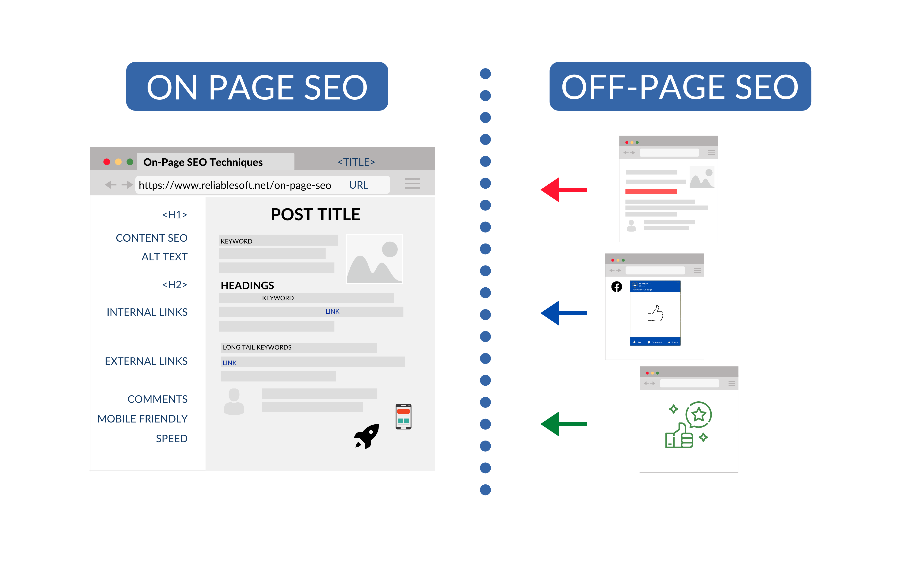

## سئوی خارجی

سئو خارجی شامل تمام اقداماتی می‌شود که در خارج از وب سایت شما انجام می‌شود، تا جایگاه بهتری در صفحه نتایج موتور جست‌وجو کسب کنید. در واقع سئو خارجی سایت به گوگل می‌گوید که افراد چه احساسی نسبت به وب سایت شما دارند. هرچقدر لینک‌های باکیفیت‌ و نظرات مثبت بیشتری نسبت به سایت شما ثبت شود، گوگل نیز این موارد را به عنوان یک امتیاز مثبت برای شما در نظر خواهد گرفت.

توجه داشته باشید که تفاوت سئو داخلی و سئوی خارجی صرفا در این است که تلاش‌ها در کدام بخش (داخل سایت یا بیرون آن) انجام می‌شود. اما در نهایت، همه‌ی آن‌ها از جنس بهینه‌سازی برای موتورهای جست‌وجو هستند.

بنابراین، با وجودی که حرف زدن از تاثیر نسبی این دو دسته تکنیک، منطقی و قابل درک است، اما باید همواره به خاطر داشته باشیم که سئو داخلی و سئو خارجی مکمل یکدیگر هستند و موتورهای جست‌وجو چنین تفکیکی را قائل نیستند و این بحث، صرفا یک طبقه بندی است.

بخش اعظم تمرکز سئوی خارجی روی این است که نشان دهد بقیه (چه در سایت‌ها دیگر و چه در شبکه‌های اجتماعی)، اعتبار سایت شما یا محتوای شما را تایید کرده‌اند. گوگل این تایید را از طریق لینک‌هایی که به سایت شما داده شده، بحث‌هایی که در شبکه‌های اجتماعی راجع‌به شما به راه افتاده و حتی تعداد دفعاتی که کاربران نام برند شما را جست‌وجو کرده‌اند، متوجه می‌شود.

