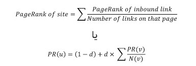

## الگوریتم پیج رنک چیست؟

پیج رنک گوگل، سیستمی است که برای اولین بار در دانشگاه استنفورد به عنوان یک پروژه تحقیقاتی در مقطع دکترا، توسط فردی به نام لری پیج توسعه یافت. پروژه تحقیقاتی لری پیج بر اساس کاوش بر روی خواص ریاضیاتی سیستم لینک دهی در دنیای مجازی بود. او روشی را تعریف کرد که هر لینکی در وب سایت را مورد بررسی قرار می‌دهد و برای هر کدام امتیازی در نظر می‌گیرد. در این سیستم هر لینک از یک وب سایت به عنوان یک رای شناخته می‌شود. داشتن لینک از وب سایت‌های محبوب، ارزش بالاتری نسبت به سایت‌های معمولی دارد.

پیج رنک گوگل توسط یک فرمول ریاضی اختصاصی مشخص می شود که در آن، تمام لینک هایی که به یک سایت داده شده‌اند، به عنوان یک رای محسوب می‌شوند. در حقیقت، سایت شما با سایر سایت‌هایی که محتوا و کلمات کلیدی یکسان دارند، مقایسه می‌شود و میزان محبوبیت آن ارزیابی می‌شود. هر چه تعداد لینک‌های یک سایت بیشتر باشد و این لینک‌ها از سایت‌های محبوب و ارزشمند به دست آمده باشند، آن سایت می‌تواند رتبه بهتری در موتور جست‌وجوی گوگل کسب کند.

به همین خاطر کسب بک لینک از دیگر سایت ها بسیار مهم است. هر رای یا لینکی که به سایت شما داده می‌شود در تعیین ارزش سایت به موتور جست‌وجوگر کمک خواهد کرد. با این حال تنها تعداد لینک‌هایی که سایت شما دریافت می‌کند مهم نیست. گوگل به دنبال لینک‌های خوب و با کیفیت می‌گردد و ارزش سایت‌هایی که به شما لینک داده‌اند را بررسی می‌کند. به عنوان مثال، زمانی که از یک سایت مهم با محبوبیت بالا لینک دریافت می‌کنید، شانس اینکه در نتایچ گوگل رتبه بندی بالاتری کسب کنید، بیشتر خواهد شد.

اگر سایت شما دارای محتوا و سئوی داخلی فوق العاده است (کلمه کلیدی، متا تگ و ...)، باید استراتژی را برای آن در نظر بگیرید تا توسط کاربران دیده شود. در ادامه به برخی از استراتژی های بک لینک سازی اشاره می کنیم که می‌تواند در به دست آوردن پیج رنک بالاتر به شما کمک کند:

-   از قرار دادن سایت خود در لینک فارم ها (مزارع لینک) پرهیز کنید. این سایت‌ها لینک‌های ارزشمندی برای شما فراهم نمی‌کنند.
-   سعی کنید محتوایی داشته باشید که توسط سایت های نقد و بررسی معتبر و قابل اعتماد، مورد بررسی قرار می‌گیرد. نقد و بررسی‌های غیر پولی بهترین روش برای دریافت لینک محسوب می‌شوند.
-   سایر وب سایت‌های موجود را بررسی کنید و از آن‌ها بخواهید به سایت شما لینک بدهند. سرمایه‌گذاری مشترک یک روش خوب برای تبادل لینک محسوب می‌شود.
-   به انجمن های آنلاین محبوب بپیوندید و کامنت های با ارزشی در پست های مرتبط آنها ارسال نمایید. شما می توانید در بحث های موجود شرکت کنید و در میان این بحث ها به سایت خود لینک دهید.
-   دقت داشته باشید که کامنت گذاری بیش از حد می تواند وب سایت شما را به گوگل پنالتی دچار کند.
-   مقالاتی را بنویسید که بتواند توجه افراد را به خود جلب کند. چنین مقالاتی می‌توانند منبع ارزشمندی برای افراد باشند. اگر یکی از مقالات یا پست‌های وبلاگ شما توسط شبکه‌های اجتماعی پربازدید که در بخش‌های قبلی بررسی کردیم به اشتراک گذاشته شود، نه تنها بک لینک قدرتمندی دریافت می‌کنید بلکه افزایش خوبی در ترافیک سایت‌تان خواهید داشت.
