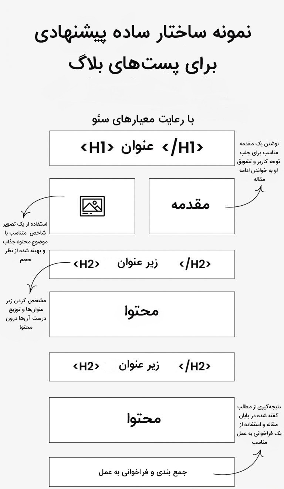

## تولید محتوای باکیفیت و ارزشمند

برای شروع باید به این نکته دقت داشته باشید که **محتوا فقط متن نیست**! بلکه شامل ویدئو، تصاویر، پادکست و دیگر موارد نیز هست. پس سعی کنید از تمام این قابلیت‌ها به تناسب استفاده کنید. یعنی علاوه بر محتوای متنی که عامل اصلی در زمینه رتبه‌بندی موتور جست‌وجو است، از یک ویدیوی مکمل استفاده کنید؛ چند عکس منحصر به فرد در محتوا قرار دهید، تصاویری که در وب‌سایت‌های دیگر نیستند یا اگر هم هستند، شما آن‌ها را برای خودتان شخصی‌سازی کرده‌اید تا منحصر به فرد شوند.

سعی کنید یک پادکست 3 تا 5 دقیقه‌ای هم برای محتوای صفحه مربوطه در وب‌سایت در نظر بگیرید. به این صورت محتوای شما به بهترین شکل بهینه‌سازی می‌شود و موتور جست‌وجو ارزش بالایی برای آن صفحه در نظر می‌گیرد.

نکته دیگری که در زمینه تولید محتوا وجود دارد، این است که باید مخاطب خود را بشناسید. سپس متناسب با نیاز مخاطب اقدام به تولید محتوا کنید. یعنی باید محتوا را با هدف کاربر از جست‌وجوی کلمه کلیدی هماهنگ کنید. محتوایی ایجاد کنید که با آنچه که کاربر در هنگام جست‌وجو به دنبال آن است، متناسب باشد.

برای محتوای خود تنها یک کلمه کلیدی اصلی انتخاب کنید. وقتی کلمه کلیدی خود را انتخاب کردید، آن را تنها برای یکی از صفحات محتوای سایتتان در نظر بگیرید. یک کلمه کلیدی اصلی هرگز نباید برای بیش از یکی از صفحات محتوای سایت در نظر گرفته شود. برای محتوایتان سه تا پنج کلمه کلیدی مرتبط انتخاب کنید. کلمات کلیدی مرتبط، عبارات و واژه‌هایی هستند که مترادف کلمه کلیدی اصلی بوده یا از نظر معنایی با آن مرتبط هستند.

محتوای تولید شده باید جذاب و کاربرپسند باشد. اما نباید تکراری، کپی شده و بی کیفیت باشد، چون گوگل می‌تواند این موارد را به خوبی شناسایی کند. دقت داشته باشید که نوشتن یک عنوان مناسب برای محتوا باید زمان زیادی صرف کنید و آن را به بهترین شکل ممکن در بنویسید (در بخش‌های بعدی مفصل به تکنیک‌های عنوان نویسی خواهیم پرداخت).

تعداد کلمات محتوا بسته به هدف صفحه و عمق موضوع متفاوت خواهد بود. اما بهترین روش این است که صفحاتی منتشر کنید که متن آن‌ها حداقل 300 کلمه باشد. هرگز از محتواهایی که در سایت‌های دیگر و یا در سایت خودتان منتشر شده است کپی نکنید. اگر شما محتوای کپی را منتشر کنید ممکن است سایت شما توسط موتورهای جست‌وجو جریمه شود و در رتبه بندی قرار نگیرد.

با اشاره به کلمه کلیدی اصلی در اولین و آخرین پارگراف، به موتورهای جست‌وجو نشان دهید که این صفحه کاملاً به موضوع مرتبط است. سعی کنید نزدیک به ابتدای پارگراف اول متن و داخل پارگراف آخر آن از کلمه کلیدی هدف استفاده کنید تا بهتر نشان دهید محتوایتان درباره چه موضوعی است. این کار باعث می‌شود موتورهای جست‌وجو به وضوح متوجه شوند که چرا محتوای شما با کلمه کلیدی مرتبط است.

علاوه بر این موارد باید به ساختار محتوا نیز دقت شود. که عنوان‌ها و زیرعنوان ها به صورت درست استفاده شوند. نحوه ارائه محتوا نیز بسیار تاثیر گذار است. فونت انتخاب شده و سایز آن نباید به شکلی باشد که کاربر از خواندن مطالب خسته شود و از وبسایت خارج گردد.

سعی کنید مواردی همچون فاصله مناسب بین خطوط و پاراگراف‌ها و مواردی از این قبیل که کمک می کند خوانایی محتوای شما بهتر شود را حتما رعایت کنید. از پاراگراف های طولانی استفاده نکنید!

اینفوگرافیک زیر یک مثال مناسب برای تولید محتوای ارزشمند است.

