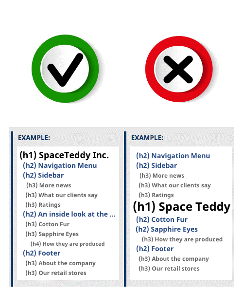

## رسیدگی به تگ‌های هدینگ و ساختار سلسله مراتبی

یکی از عواملی که باعث منظم‌تر و جذاب‌تر دیده شدن ساختار یا مطالب یک صفحه وب می‌شود و همچنین بر بهبود سئو سایت به شدت اثرگذار است، استفاده صحیح و به جا از تیتر هاست. تیترها در HTML بر اساس درجه‌ی اهمیت و اولویت، به ترتیب در ۶ سطح از تگ h1 مهم‌ترین تا تگ h6 کم اهمیت‌ترین شماره‌گذاری می‌شوند.

تگ‌های هدینگ، تگ‌های بین المللی در HTML است که برای بیان ویژگی‌های متن و تعیین میزان اهمیت متن به موتورهای جست‌وجو کاربرد دارد. تگ‌های هدینگ مهم ترین کدهای HTML برای بخش محتوای سایت است. اضافه کردن این تگ ها باعث می شود به بهینه سازی سایت کمک کنید و موتورهای جست‌وجو و همچنین کاربران سایت شما را به عنوان سایت حرفه‌ای‌تر بشناسند.

بدون استفاده از تگ‌های هدینگ فقط صفحاتی با متن‌های طولانی تولید می‌کنید که کاربردی نخواهند داشت. تگ‌های هدینگ مشخص می‌کنند که ارتباط بین قسمت‌های مختلف متن چگونه است. وظیفه تگ هدینگ مشخص کردن عناوین هر پاراگراف و ارتباط دادن پاراگراف‌ها با زیر عنوان‌ها می‌باشد که نتیجه این ارتباط مشخص کردن عناوین مهم برای درک بهتر مطلب توسط گوگل و کاربران می‌باشد.

-   H1: تگ h1 را در متن‌های خود برای عنوان داخلی صفحه قرار دهید. در هر صفحه تنها از یک تگh1 می توان استفاده کرد. گوگل با استفاده از این تگ به موضوع هر صفحه از سایت پی می‌برد و به همین دلیل تگ h1 در موتورهای جست‌وجو از اهمیت بالایی برخوردار است.
-   H2: بعد از تگ h1 تگ h2 مطرح می‌شود که بیشترین استفاده را در متن سایت مخصوصا متن‌های طولانی دارد. تمام تیترهای پاراگراف‌ها با تگ h2 برچسب می‌خورند و باعث ارتباط بین پاراگراف‌ها با عنوان سایت می‌شود. با استفاده از کلمات کلیدی در تگ‌ها گوگل متوجه می شود که کلمه‌ی کلیدی شما چه چیزی است و شما را برای این کلمات به کاربران پیشنهاد می‌دهد.

    می‌توانید کلمات هم خانواده و مترادف برای کلمه‌ی کلیدی اصلی خود را پیدا کنید و عنوان های پاراگراف خود را با این کلمات بنویسید سپس با قرار دادن این عناوین در تگ h2 با این کلمات هم سئو خواهید شد.

-   H3، H4، H5، H6: به همین ترتیب می‌توان از بقیه تگ‌ها هم برای زیر عنوان‌های پاراگراف‌ها (h2) استفاده کرد. کاربری بقیه تگ‌ها به اندازه‌ی تگ h1 و h2 نیست. تگ h3 را هم برای زیر عنوان‌های پاراگراف‌ها استفاده کنید. در متن‌های طولانی حتما زیر عنوان‌هایی دیده می‌شود که باید از تگ h3 برای ارتباط آن با عنوان پاراگراف مربوطه استفاده کرد.

نکته‌ی مهم دیگر در زمینه استفاده از تگ‌ها این است که نمی‌توان بعد از استفاده از تگ h1 برای عنوان پاراگراف بعدی از تگ h3 به بعد استفاده کرد. یعنی استفاده از تگ‌ها باید به صورت نزولی یا همان سلسله مراتبی صورت گیرد. اگر در صفحات خود از تگ ها استفاده کردید ترتیب را رعایت کنید. بعد از تگ h1 حتماً باید h2 استفاده شود. بعد از تگ h2 حتماً باید از تگ h3 استفاده شود. اشتباه وارد کردن ترتیب تگ‌ها تاثیر منفی‌ در سئو سایت خواهند گذاشت.

