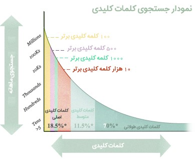
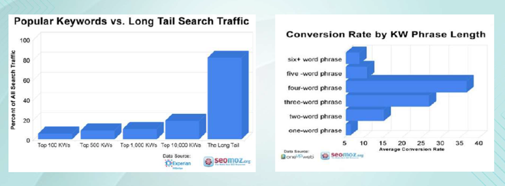
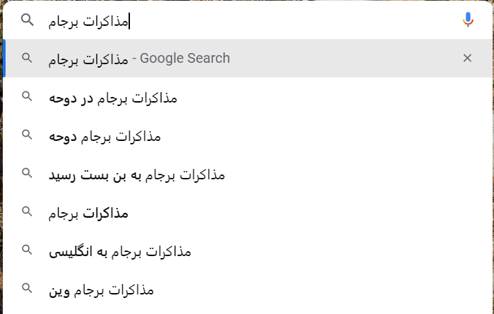
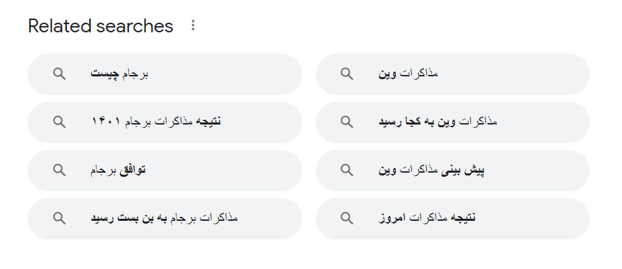
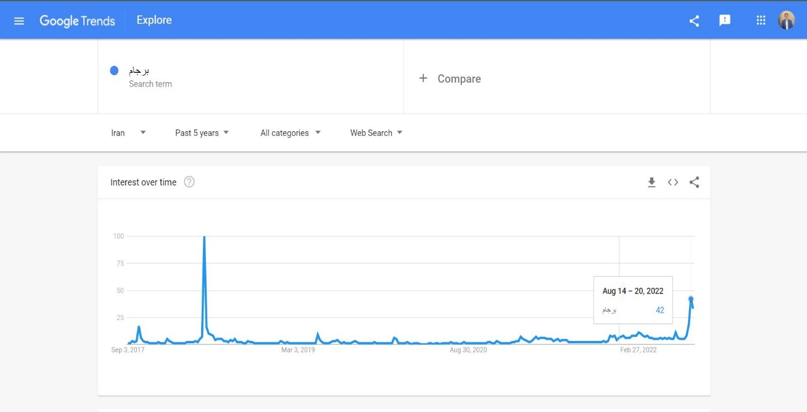
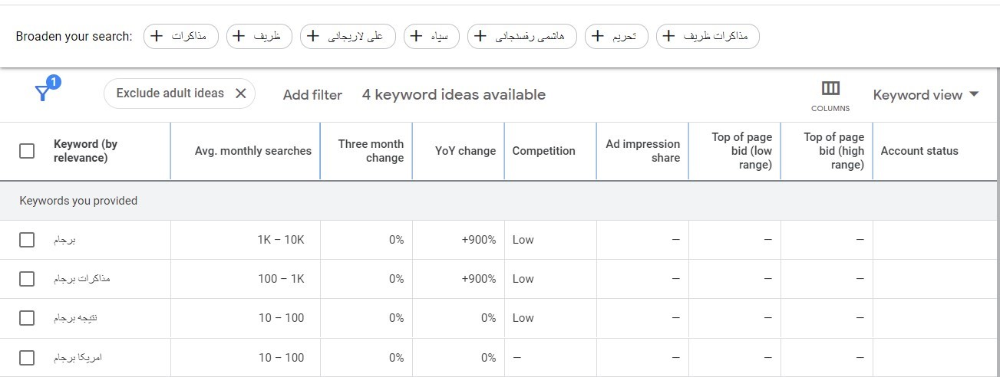
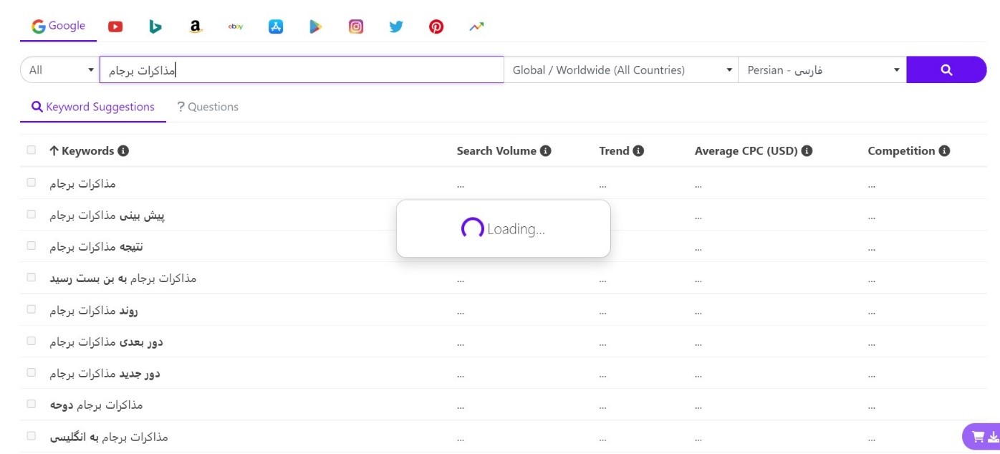
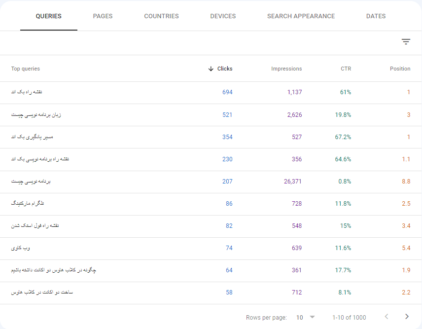

## تحقیق  و بررسی کلمات کلیدی ارزشمند

تحقیق کلمات کلیدی به معنی بررسی تعداد جست‌وجوهای هر کلمه یا عبارت در گوگل است؛ به کمک این تحقیق شما می‌توانید بفهمید که کاربران در حوزه کاری شما به دنبال چه چیزی هستند؛ حتی می‌فهمید که کدام یک از این موضوعات برای آن‌ها بیشتر اهمیت دارد؟ چه کلماتی برای کسب و کار شما مهم‌تر است و ارزش بیشتری دارد. چه تعدادی از آدم‌ها به موضوع کسب و کار شما علاقه‌مند هستند و برند شما را جست‌وجو می‌کنند. حتی می‌توانید بررسی کنید که آیا روند تعداد جست‌وجو در حال افزایش هست یا نه (که یعنی پتانسیل سرایت‌پذیری شما چقدر جای رشد دارد.)

در واقع اگر بخواهم دقیق تر بگویم، هدف گذاری در سئو با انتخاب کلمات کلیدی انجام می‌شود. هدف از انجام تحقیق در زمینه کلمات کلیدی، جذب آن دسته بازدیدکنندگانی است که محتوای سایت شما برایشان مفید است و دقیقاً به دنبال محتوای شما هستند. در واقع شما نه تنها خواهید فهمید کدام عبارات‌ و کلمات کلیدی، سئوی سایت شما را بهبود می‌دهد، بلکه جامعه مخاطبان خود را نیز بهتر خواهید شناخت.

در نگاه کلی‌تر با تحقیق درباره کلمات کلیدی می‌توانید تغییرات در نیاز مخاطبان را پیش‌بینی کنید، به این تغییرات واکنش مناسب نشان دهید، و خدمات و محتوایی تولید کنید که مردم به دنبالشان می‌گردند.کلمات کلیدی امروزه به سمت طولانی‌تر شدن پیش می‌روند. ما علت این موضوع چیست؟

عبارت‌های تک کلمه‌ای شاید ترافیک بیشتری را به همراه داشته باشند، اما چندان هدفمند نیستند و رقابت بالایی بر روی آن‌ها وجود دارد. در نقطه مقابل، کلمات کلیدی طولانی‌تر شاید میزان جست‌وجوی کمتری داشته باشند، اما در زمینه تبدیل مخاطب به مشتری بهتر عمل می‌کنند و رقابت کمتری بر روی آنها وجود دارد.

به طور مثال ترافیک کلمه برجام زیاد است اما این ترافیک خیلی هدفمند نیست. یعنی از کلمه کلیدی **برجام** می‌توان برداشت‌های زیادی کرد و برای اهداف مختلفی آن را جست‌وجو کرد. اما وقتی کلمه کلیدی طولانی‌تر می‌شود مانند **نتیجه مذاکرات برجام در وین** درست است که ترافیک ورودی کمتری را به همراه دارد، اما هدف کاملا مشخص است و صفحه‌ای که برای این موضوع ایجاد می‌شود کاملا تفکیک شده است و با دیگر صفحات ایجاد مشکل نمی‌کند.

از طرفی در نظر داشته باشید که رتبه گرفتن در این عبارات طولانی راحت‌تر از کار بر روی عبارات تک یا دو کلمه‌ای است. پس با صرف زمان و منابع کمتر می‌توان به نتیجه دلخواه در صفحه نتایج موتور جست‌وجو رسید. در ادامه راجع به این موضوع صحبت خواهیم کرد که خود کلمه **برجام** می‌تواند یک دسته‌بندی یا لندینگ اصلی باشد که از آن تحت عنوان پیلار یاد می‌شود. و سایر جزئیات و عبارات طولانی می‌توانند کلاسترهایی باشند که اعتبار و ترافیک آن را افزایش می‌دهند.

نمودار زیر از بررسی‌های سایت SEOMOZ (که یکی از منابع اصلی سئو در دنیاست) بر روی 5000 سایت مختلف بدست آمده و نشان دهنده موضوعی است که راجع به آن توضیح دادیم. در واقع مطابق این نمودارها هرچقدر کلمات کلیدی طولانی‌تر باشد، هدفمندتر و نرخ تبدیل آن بیشتر است. یعنی به عنوان مثال جذب مخاطب برای خبرنامه از صفحاتی با کلمه کلیدی طولانی راحت‌تر انجام می‌شود.

در ادامه روش‌ها، ابزارها و معیاری‌هایی را بررسی خواهیم کرد که با استفاده از آن‌ها می‌توانید لیست کلمات کلیدی مورد نظرتان را استخراج کرده و سیستم امتیاز دهی برای آن‌ها در نظر بگیرید. یعنی بعد از شناسایی کلمات کلیدی و تکمیل لیست، به اولویت‌های بالاتر که شما را سریع‌تر به اهدافتان می‌رساند، امتیاز بیشتر اختصاص دهید.

در ابتدا فهرستی از موضوعات مهم و مرتبط به آنچه از کسب و کارتان می‌دانید تهیه کنید. برای شروع کار، به سرفصل‌های کلی خود فکر کنید. بسته به نوع و حجم کسب‌و‌کارتان، ممکن است به 5 تا 10 موضوع کلی برسید. این سرفصل‌ها می‌توانند دسته‌بندی‌های موضوعی کلی سایت شما باشند. سپس این لیست را با استفاده از روش‌های زیر توسعه دهید.

### چگونه لیست کلمات کلیدی را توسعه دهیم؟

-   شناخت مخاطب و تحلیل نیازهای او با استفاده از داده‌ها و اطلاعات بدست آمده از فعالیت هدفمند در شبکه‌های اجتماعی. در واقع وقتی شما نیاز مخاطب در زمینه اطلاعاتی و خبری را به خوبی شناسایی کرده باشید، به راحتی می‌توانید محتوایی تولید کنید که آن نیاز به خصوص را برطرف کند. در این صورت هم رتبه بهتری کسب می‌کنید و سایت شما با اقبال کاربران زیادی روبه‌رو می‌شود که در بلند مدت بر روی سئو کل سایت تاثیرگذار است نه فقط یک صفحه به خصوص.
-   تعیین پرسونای مخاطب (در بخش توییتر مفصل توضیح داده شده). خود را به جای مخاطب خود بگذارید. آن‌ها به دنبال چه موضوعاتی می‌گردند که ممکن است از طریقشان به شما برسند؟
-   تحقیقات میدانی و پرسش از مخاطب با استفاده از پرسشنامه‌های چاپی یا آنلاین با گزینه‌های مشخص
-   تحلیل سایت رقبا با استفاده از ابزارهای SEMRush و یا Content Kingapp برای اینکه متوجه شویم بیشتر ورودی دریافتی آن‌ها از چه صفحاتی است. سپس به آن صفحات مراجعه کنیم و کلمات کلیدی را بررسی کنیم. لزومی ندارد هر کاری که رقبای شما انجام می‌دهند شما هم عینا انجام دهید. این مسئله درباره کلمات کلیدی هم صادق است. اگر یک کلمه برای رقیب شما مهم است، لزوما برای شما نباید مهم باشد، اما به هرحال دانستن آنکه رقبا از چه کلمات کلیدی برای جذب ترافیک استفاده می‌کنند اهمیت فراوانی دارد. کار شما باید متمرکز بر دو جنبه مختلف باشد: بهبود وضعیت خودتان در رابطه با کلمات کلیدی مورد استفاده رقبا و پرداختن به کلماتی که رقبا هنوز به سمت آنها نرفته‌اند.
-   استفاده از پیشنهاد‌های گوگل در هنگام جست‌وجوی کلمات کلیدی مختلف نیز ایده خوبی برای گسترش کلمات کلیدی است. این پیشنهادات بر مبنای جزئیاتی که کاربران بیشتر به دنبال آن‌ها بوده‌اند و جست‌وجوهای مشابه لیست می‌شود.

- نمودار بالا نشان دهنده پیشنهادات گوگل و نمودار پایین نشان دهنده جست‌وجوهای مشابه

-   استفاده از ابزار Google trend برای مشخص کردن میزان رشد یا افت جست‌وجوی کلمات کلیدی خاص در بازه‌های زمانی مشخص. به عنوان مثال نمودار زیر مربوط به میزان جست‌وجوی عبارت برجام در بازه زمانی 5 سال اخیر است. به راحتی مشاهده میکنیم که پس از جدی شدن مذاکرات اخیر میزان جست‌وجوی این عبارت به طرز شگفت‌انگیزی افزایش یافته است. پس اکنون زمان مانوور بر روی این کلمه کلیدی است.

-   استفاده از ابزارهایی همچون google keyword planner، keywordtool.io، kwfinder و... در زمینه بررسی کلمه به کلمه هم ایده بسیار خوبی است. باید دقت داشته باشید که آمار و ارقام این ابزارها به دلیل ضعف در زمینه تحلیل زبان فارسی و همچنین وجود برخی تحریم‌ها خیلی برای منطقه ایران و زبان فارسی دقیق نیست. اما در کل معیار مناسبی برای سنجش نسبی میزان ترافیک و مقایسه کلمات کلیدی با یکدیگر هستند.

به عنوان مثال اگر به تصویر بالا که از ابزار google keyword planner به راحتی متوجه خواهید شد که میزان جست‌وجو کلمه کلیدی **برجام و مذاکرات برجام** بسیار بیشتر از سایر گزینه‌ها است و حتی در بازه زمانی کوتاه مدت که روند مذاکرات از سر گرفته شده و اخبار آن منتشر می‌شود، جست‌وجوی این عبارت‌ها رشد 900 درصدی را تجربه کرده است.

در ادامه هم نمونه‌ای از ابزار keywordtool.io اورده شده است که با جست‌وجوی عبارت **مذاکره برجام**، مجموعه کاملی از کلمات کلیدی را به ما پیشنهاد داده است و آن‌ها را از نظر میزان جست‌وجو، میزان سختی کار برای رتبه گرفتن و حتی میزان ترند شدن مورد مقایسه قرار داده است.

-   همچنین بعد از اینکه مدتی از فعالیت سایت گذشت، برای گسترش کلمات کلیدی و بهبود محتوای سایت می‌توان از گوگل سرچ کنسول نیز استفاده کرد. وقتی به بخش performance سرج کنسول مراجعه کنید، اطلاعات کاملی نسبت به پرس‌وجوهایی که کاربران تا کنون جست‌وجو کرده‌اند و با استفاده از آن‌ها به وبسایت شما دسترسی داشته‌اند، بدست خواهید آورد.

این اطلاعات مشابه تصویر بالا است. یعنی شما پرس‌وجو مورد نظر را به همراه میزان نمایش، کلیک، نرخ کلیک و رتبه آن در صفحه نتایج را مشاهده می‌کنید. این جزئیاتی که از سمت گوگل ارائه می‌شود ایده‌های خوبی برای توسعه لیست کلمات کلیدی به شما می‌دهد. در واقع شما با نحوه جست‌وجوی مخاطبان هدفتان آشنا می‌شوید و متوجه می‌شوید که آنها بیشتر به دنبال چه چیزهایی هستند. سپس می‌توانید این ساختار بدست آمده را به کلمات کلیدی و صفحات گوناگون منتقل کنید.

پس به طور کلی با کمک داده‌های مهم سرچ کنسول، شما قادر خواهید بود تا کلمات کلیدی با ارزشی که توسط کاربران استفاده شده‌اند را پیدا کرده و از آن‌ها برای بهبود بخشیدن به روند پیشرفت و بهینه‌سازی عملکرد سایت خود استفاده کنید.

### معیارهای انتخاب کلمات کلیدی

-   تعداد رقبا
-   قدرت رقبا از نظر عمر دامنه و نحوه فعالیت (مثلا فرکانس تولید محتوای روزانه و تعداد کل محتواهای فعلی)
-   میزان جست‌وجوی آن کلمه کلیدی خاص
-   شناخت نیاز مخاطب (با توجه به پرسونا و معیارهایی که در بخش توییتر به صورت مفصل توضیح داده شده)
-   میزان ارزشی که می‌توان بر روی آن کلمه کلیدی ایجاد کرد (به عنوان مثال اگر ارزش جلب توجه مخاطب باشد، باید بررسی کرد چند نفر پس از بازدید آن محتوای خاص به عضویت خبرنامه وبسایت شما در آمدند.)
