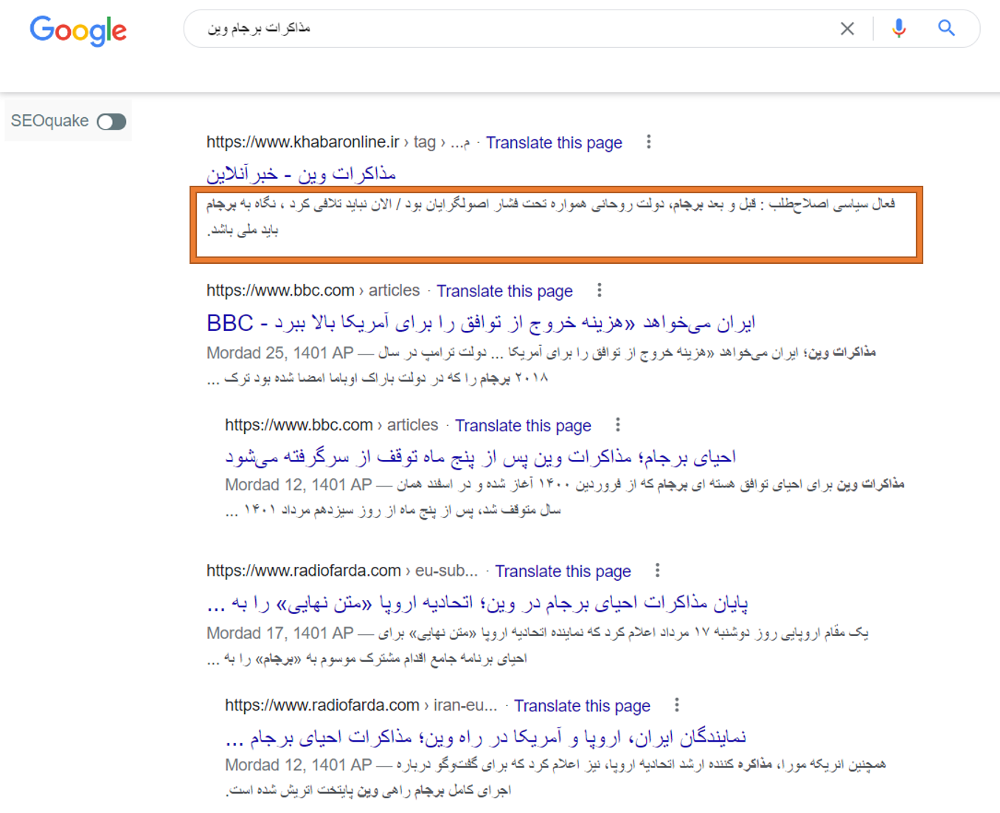

## رسیدگی به تگ عنوان و متاتگ‌های صفحات

در بخش سئو تکنیکال به اهمیت متاتگ‌هایی همچون کنونیکال و ربات اشاره کردیم. در بخش سئو داخلی قصد داریم متاتگ‌هایی را بررسی کنیم که ارتباط بیشتری با محتوای هر صفحه دارند و برای هر صفحه باید کاملا منحصر به فرد باشند.

تگ title، یک تگ کاربردی و بسیار مهم است که به عنوان فرزند تگ head درون آن نوشته می شود و برای نمایش عنوان هر صفحه وب به کار می رود. استفاده از این تگ برای تمامی صفحات HTML الزامی است. در واقع شما باید برای هر صفحه وبسایت خود عنوان منحصر به فردی داشته باشید؛ که در ادامه تکنیک‌هایی را برای انجام این کار مطرح خواهیم کرد.

تکنیک‌های عنوان نویسی:

-   اندازه عنوان نباید خیلی کوتاه باشد که پیام اصلی را به مخاطب نرساند. همچنین نباید آنقدر طولانی باشد که قسمتی از آن در نتایج گوگل نشان داده نشود. استفاده از 60 تا 70 کاراکتر برای نوشتن یک عنوان جذاب و حرفه‌ای مناسب است. عنوان شما باید پیام اصلی محتوا را رسانده و از سوی دیگر باید به اندازه کافی تاثیرگذار باشد.
-   هنر نویسندگی، در ساده‌نویسی است. از گفتن کلمات ثقیل یا قلمبه‌سلمبه، پرهیز ‌کنید. خواننده دوست دارد که وارد سایت شده و در کمترین زمان، به اطلاعات مورد نیاز خود دست پیدا کند. از این رو پیشنهاد می‌شود که ساده‌نویسی را نه تنها در عنوان، بلکه در کل محتوای خود رعایت کنید.
-   انسان برای رهایی از احساس ترس، حاضر است هر کاری بکند. مثلا اگر کسی به شما بگوید که با خوردن فلان ماده غذایی سرطان می‌گیرید؛ احتملا خوردن آن را کم یا متوقف خواهید کرد. شما هم می‌توانید حس ترس را در دل مخاطبین خود ایجاد کنید. در واقع غیرمستقیم به آن‌ها می‌گویید که اگر محتوای شما را نخوانند، چیز مهمی را از دست داده یا اینکه در آینده دچار مشکل خواهند شد.
-   مغز انسان به گونه‌ای طراحی شده که دوست دارد به جواب سؤالات خود برسد. همان زمانی که سؤالی ذهن شما را درگیر کرده و برای پاسخ به آن گوگل را زیر و رو می‌کنید. در عنوان نویسی هم باید با این کار، حس کنجکاوی مخاطب را فعال کنید. در این حالت مخاطب به سایت شما وارد شده تا جواب سوال ایجاد شده در ذهنش را پیدا کند.
-   قول برآورده شدن مشکل را در عنوان، به مخاطب بدهید. اما قبل از هر چیز شما باید مخاطب خود را بشناسید. یعنی تحقیق کنید که مخاطبین شما چه دغدغه‌ها، نیاز‌ها و مشکلاتی را دارند؟ سپس به نوعی عنوان نویسی کنید که مخاطب مطمئن شود با مراجعه به محتوای شما، دغدغه‌اش برطرف خواهد شد.
-   تحقیقات روانشناسی نشان داده است که اعداد توجه انسان‌ها را به خود جلب می‌کند. زمانی که شما در عنوان خود از عدد استفاده می‌کنید، مخاطب حس خوبی با محتوای شما برقرار می‌کند. به همین جهت عناوینی که در ابتدای آن‌ها عدد وجود دارد، بیشتر مورد توجه قرار می‌گیرند. همچنین استفاده از درصد را به هیچ عنوان فراموش نکنید. ما در زندگی روزمره خود نیز در بیشتر اوقات و برای ساده کردن موضوع، از درصد استفاده می‌کنیم. اعداد و درصد‌ها نشان از قاطعیت و تسلط شما به متنی است که نوشته‌اید.
-   انسان‌ها تمایل دارند که کارها را در مدت زمان کمتری انجام دهند. در هنگام نوشتن عنوان، به مخاطب وعده بدهید که با خواندن محتوای شما، در زمانش صرفه جویی خواهد کرد. مسلما هیچ‌کس بدش نمی‌آید که کارهای خود را زودتر انجام داده و وقت بیشتری برای خود داشته باشد.
-   همه ما علاقه داریم بدانیم که رتبه اول‌ها چه کسانی یا چه چیزهایی هستند. مثلا قدرتمندترین ارتش جهان متعلق به کدام کشور است؟ پرفروش‌ترین فیلم امسال کدام بوده است؟ پولسازترین بازیگر ایران چه فردی است؟ بدمزه‌ترین غذای جهان کدام است؟ اگر دقت کنید تمامی این موارد، داری پسوند **ترین** در ساختار خود هستند. در واقع این پسوند، برتری را می‌رساند که برای خوانندگان بسیار جالب است.
-   در هنگام عنوان نویسی محتوا، استفاده از کلمه **چگونه** را فراموش نکنید. تیتر‌هایی که با چگونه شروع می‌شوند، محبوبیت زیادی داشته و بسیار کلیک‌خور هستند. مخاطب با خواندن این کلمه، متوجه می‌شود که قرار است یک مطلب کاملا آموزنده را مطالعه کند.
-   از کلمه کلیدی در عنوان استفاده کرده و سعی کنید که آن را در اول عبارت قرار دهید.
-   در هنگام نوشتن عنوان، از کلمات اختصاری استفاده نکنید. مثلا به کار بردن کلمه آجا، به جای ارتش جمهوری اسلامی ایران.
-   عنوان را چندین بار بخوانید و بررسی کنید که آیا کلمات اضافی در آن وجود دارد؟ یعنی حرف‌ها یا کلماتی که بود یا نبود آن‌ها تاثیری در عنوان شما ندارد.
-   بعد از نوشتن عنوان، آن را با دقت بخوانید و مطمئن شوید که در آن غلط املایی وجود نداشته باشد. وقتی شما در عنوان خود غلط املایی دارید؛ اعتبار مقاله شما نزد مخاطب زیر سؤال خواهد رفت.
-   یکی دیگر از تکنیک‌های عنوان نویسی، استفاده از تاریخ است. مثلا عنوان «دور جدید مذاکرات برجام میان ایران و آمریکا آغاز شد - آپدیت 2022» برای شما جذاب نیست؟
-   نام بردن از افراد مشهور، یکی دیگر از روش‌های نوشتن یک عنوان جذاب است. مانند «7 استراتژی جنگ نرم از دیدگاه سردار سلیمانی».

## رسیدگی به توضیحات متا

در میان متا تگ‌ها، توضیحات متا از اهمیت بالایی برخوردار است. تگ توضیحات متا در واقع چکیده‌ای از محتوای سایت در یک صفحه به خصوص را ارائه می‌دهد که از چشم بازدیدکنندگان درون سایت پنهان است ولی برای درک بهتر موتورهای جست‌وجو استفاده می‌شود و درون نتایج گوگل نیز قابل مشاهده است.

هر بار که صفحه ای از سایت شما در نتایج جست‌وجوی گوگل نمایش داده میشود در واقع یک Impression رخ داده است و زمانیکه کاربر بر روی این نتیجه کلیک کند برای شما یک Click در نظر گرفته می‌شود. تعداد کلیک به نسبت نمایش یا نرخ کلیک سایت شما (CTR) در صفحه نتایج جست‌وجوی گوگل تاثیر زیادی بر رتبه بندی شما از نظر گوگل خواهد داشت.

هرچه CTR صفحات سایت شما بالاتر باشد در رتبه بندی گوگل جایگاه بهتری خواهید داشت و این امر اهمیت تگ توضیحات متا را بهتر نشان میدهد. تحقیقات جدید نشان می‌دهد که گوگل در الگوریتم رنک برین خود اهمیت زیادی برای توضیحات متا از جهت افزایش نرخ کلیک CTR قائل است.

-   گاهی اوقات خود موتور جست‌وجو متناسب با کوئری سرچ شده از سمت کاربر، این تگ را از محتوای صفحه مقداردهی کرده و به کاربر نمایش می‌دهد، اما این موضوع همیشگی نیست و شما باید محتوای مناسبی برای این تگ در نظر بگیرید.
-   تحت هیچ شرایطی از تگ توضیحات متا تکراری برای صفحات استفاده نکنید. هر صفحه باید تگ مخصوص خودش را داشته باشد. اگر از افزونه‌هایی استفاده می‌کنید که به صورت خودکار متا تگ را برای شما پر می‌کند احتمال تکراری شدن موضوع صفحات‌تان بالا می‌رود‌؛ زیرا ممکن است صفحاتی وجود داشته باشد که پاراگراف اول‌شان تکراری باشد. پس سعی کنید این کار را به صورت دستی مدیریت کنید.
-   تعداد کاراکترهای توضیحات متا هیچ محدودیتی ندارد ولی از آنجایی که گوگل تنها 150 تا 170 کاراکتر را در صفحه نتایج خود از توضیحات متا سایت شما نشان می‌دهد، با قراردادن کلمات کلیدی خود در ابتدای توضیحات متا آن را بهینه کنید. در صورتی که متن شما بیشتر از فضای استاندارد گوگل باشد تنها ابتدای آن نمایش داده شده و در ادامه … قرار داده می‌شود.
-   برای استفاده از کلمات کلیدی در توضیحات متا محدودیتی وجود ندارد ولی توصیه می‌شود که بیش از یک یا دو کلمه کلیدی در آن استفاده نکنید. در صفحه نتایج گوگل کلمات کلیدی موجود در تگ توضیحات متا به صورت پررنگ‌تر نشان داده می‌شوند و این موضوع به شما در جذب بازدیدکنندگان بیشتر کمک می‌کند.
-   موتورهای جست‌وجو کاراکترهایی مانند +، – و ” را بعنوان کد HTML میشناسد، در صورت استفاده از این حروف در توضیحات متا ممکن است گوگل آن را بعنوان کد شناسایی کند و به کل نادیده بگیرد. برای بهینه کردن توضیحات متا باید از متون ساده استفاده کنید.
-   توضیحات متا باید به شکلی باشد که در میان رقبا بازدیدکنندگان را به سمت سایت شما بکشد، اطلاعاتی متفاوت و تخصصی مربوط به تجارت خود را در کنار کلمات کلیدی مربوط به آن در توضیحات متا قرار دهید تا محتوای متفاوتی را ارائه داده باشید. (تکنیک‌های عنوان نویسی در این بخش نیز کاربردی هستند.)

متا تگ کلمه کلیدی نیز برای معرفی مهم‌ترین کلمات کلیدی مرتبط با یک صفحه خاص، مورد استفاده قرار می‌گیرد و بهتر است که کلمه کلیدی اصلی را به همراه 2 کلمه کلیدی فرعی در آن استفاده کنیم. به این صورت موتورهای جست‌وجو می‌توانند اطلاعات دقیق‌تری نسبت به موضوع و هدف یک صفحه از وبسایت پیدا کنند و در رتبه‌بندی صفحات از این معیار استفاده کنند.

-   زیاده‌روی در اضافه کردن کلمه کلیدی در متا تگ keyword باعث پنالتی شدن سایت شما از طرف گوگل می‌شود.
-   کلمات کلیدی خود را با هم خانواده‌هایش اضافه کنید و از تکرار تنها یک کلمه خودداری کنید.
-   برای سایت‌های فارسی از 200 کاراکتر بیشتر استفاده نشود، زیرا تقلب محسوب می‌شود.
-   برای کلمات کلیدی انگلیسی هم در متا تگ تا 400 کاراکتر مجاز است.
-   کلمات کلیدی را با " , " بدون هیچ فاصله‌ای از هم جدا کنید.

در تمام تصاویر به کار رفته در یک وب‌سایت، تگ Alt توصیف‌کننده موضوعی است که از تصویر برداشت می‌شود. این تگ می‌تواند به عنوان متنی جایگزین برای تصاویر به هنگام خطا در بارگذاری نیز مورد استفاده قرار گیرد تا کاربران در صورت عدم نمایش تصویر، از مفهوم و عملکرد آن باخبر شوند.

علاوه بر آن، مرورگرها قابلیتی دارند که معمولا افراد نابینا یا دارای اختلال بینایی برای شنیدن مطالب آنلاین از آن استفاده می‌کنند. خواندن این تگ‌ها توسط مرورگر، انتقال مفهوم و محتوای تصاویر را برای این افراد امکان‌پذیر می‌کند.

پس نوشتن این تگ باید به نوعی باشد که پس از شنیدن آن، بتوانید تصوری منطقی و کامل از تصاویر را در ذهن خود داشته باشید. البته این متن خاص که نوشته شده است باید کلمه کلیدی مرتبط با موضوع را در درون خود جای داده باشد.

گوگل برای تگ‌های Alt تصاویر، ارزش نسبتا بالایی در نظر گرفته است. این ارزش‌گذاری به دلیل فهم آسان‌تر تصاویر و تعیین موضوع محتوای پیرامون آن‌ها صورت می‌گیرد. دقت داشته باشید این ارزش‌گذاری به قدری جدی است که گوگل سرویس Google Image را به آن اختصاص داده است. البته هوش مصنوعی گوگل در پردازش عکس‌ها و درک مفهوم آن‌ها نقش اساسی دارد مانند سرویس‌هایی مانند OCR که کاملا محتوای عکس را استخراج کرده و به متن تبدیل می‌کنند. اما این تگ نیز نقش بسیار مهمی دارد.

قرار دادن تگ Alt برای تصاویر، تاثیر بسیار خوبی بر روی وضعیت سئو و ترافیک سایت شما دارد. در نظر بگیرید که کاربری به دنبال تصویر خاصی در نتایج جست‌وجوی گوگل است که ناگهان تصاویر جذاب سایت شما را مشاهده می‌کند. به این ترتیب، کاربر از طریق همان تصویر وارد سایت شما شده و به یک خواننده تبدیل می‌شود. پس اگر در سایت خود تصاویری دارید که هیچ تگ و عنوانی ندارند، بهتر است زمانی را به نوشتن عناوین و تگ‌های Alt مناسب برایشان اختصاص دهید.
