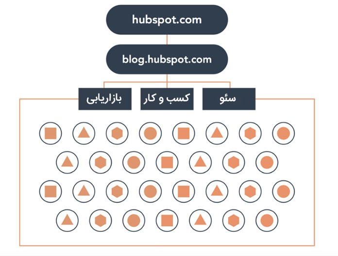

## پیاده سازی ساختار پیلار و کلاستر محتوایی

امروزه تمامی‌وب‌سایت‌ها در تلاش هستند تا بتوانند کیفیت کار خودشان را بالا ببرند و ارزش‌آفرینی کنند. تولیدکنندگان محتوا سعی می‌کنند تا با استفاده از روش‌های جدید و کارآمد، توجه افراد گوناگون را به محتوای‌شان جلب کنند. هدف از انجام این مجموعه فعالیت‌ها، کسب جایگاه بهتر درصفحات نتایج موتور جست‌وجو، افزایش سرایت‌پذیری اطلاعات و همچنین جذب مخاطبان بیشتر است.

رفتار کاربران در هنگام جست‌وجو، نسبت به گذشته تغییرات بسیاری را داشته است. به این صورت که کاربران برای جست‌وجوی مفهوم مورد نظرشان، صرفا یک کلمه کلیدی را سرچ نمی‌کنند؛ بلکه عباراتی را سرچ می‌کنند، که ممکن است شامل بیش از یک کلمه کلیدی باشد. از طرفی وب معنایی در تلاش است تا استفاده از وب را برای انسان‌ها ساده‌تر کند.

در واقع هدف از وب معنایی این است که اطلاعات در وب نه تنها برای انسان‌ها قابل فهم باشد، بلکه ماشین‌ها نیز توانایی درک و پردازش آن‌ها را به راحتی داشته باشند. بر همین اساس موتورهای جست‌وجو دائما در حال بروزرسانی هستند و پیشرفته‌تر می‌شوند. این بروزرسانی‌ها در قالب الگوریتم‌های گوناگونی ظاهر می‌شوند که قصد دارند نتایجی را برای کاربر نمایش دهند که متناسب با هدف او باشد.

این روزها کاربران تمایل دارند مستقیما هدف خودشان از جست‌وجو را بیان کنند. یعنی می‌خواهند آن سوالی که در ذهنشان است و به دنبال جوابی مناسب برای آن می‌گردند را به صورت یک عبارت چند کلمه‌ای به موتور جست‌وجو اعلام کنند. مثلا به این صورت جست‌وجو می‌کنند: " نتیجه مذاکرات برجام در وین چه بود؟"، "تکنولوژی پهپادی ایران چقدر پیشرفته است؟"، " ماهواره جدیدی که ایران در مدار قرار داد، ساخت کدام کشور است؟"، "نرخ تورم ایران در 1400 چقدر رشد کرده است؟" و موارد از این قبیل.

از طرفی هرچه پیش می‌رویم جست‌وجوی صوتی نیز محبوب‌تر می‌شود و افراد بیشتری از آن استفاده می‌کنند. با توجه به این موضوع قطعا روند انجام جست‌وجوهای طولانی‌، ساده‌تر می‌شود و افراد بیشتری از آن استفاده می‌کنند. پس میزان این نوع جست‌وجوها رو به افزایش است. در نتیجه باید استراتژی محتوایی مناسبی داشته باشید تا بتوانید به اهدافتان برسید.

### بررسی مدل پیلار کلاستر محتوایی

مدل پیلار کلاستر یکی از انواع مدل‌های تولید محتوا است که از قاعده خاصی پیروی می‌کند. این مدل بر مبنای ایجاد یک شبکه محتوایی ساختار یافته به وجود آمده است. برای اینکه بتوانید این مدل را بهتر درک کنید و آن را پیاده سازی کنید، نیاز دارید تا اجزای آن را به خوبی بشناسید.

می‌توان گفت این مدل شامل سه زیر مجموعه اصلی است. نکته قابل توجه این است که علاوه بر آن سه زیر مجموعه، جزئیات جانبی دیگری نیز وجود دارد که بسیاری از منابع اشاره چندانی به آن‌ها نکرده‌اند. در ادامه اجزای مدل پیلار کلاستر محتوایی باهم بررسی خواهیم کرد:

-   **محتوای ستونی**

هسته مرکزی این مدل، محتوای ستونی است. اما منظور از **محتوای ستونی چیست؟** محتوای ستونی یا Pillar Content یکی از انواع روش‌های تولید محتواست که با هدف ارائه کامل‌ترین اطلاعات به کاربران و همچنین بهبود وضعیت سئو وب‌سایت، ایجاد شده است. در این نوع محتوا به هر آنچه ممکن است نیاز مخاطبان باشد، پرداخته می‌شود. تولید این نوع محتوا از قاعده خاصی پیروی می‌کند و به طور ویژه‌ای با محتوای کلاستر (خوشه‌ای) مرتبط است.

محتوای ستونی مهمترین و اصلی‌ترین نوع محتوا در وب سایت شما است. یک صفحه پیلار، شامل یک محتوای جامع است که تقریبا همه چیزهایی را که مخاطبان هدف شما باید درباره یک موضوع بدانند را در بر می‌گیرد. دقت کنید که در محتوای ستونی به هر کدام از بخش‌های موضوع اصلی به صورت کلی اشاره می‌شود و توضیح کامل آن در محتواهای خوشه بندی شده قرار می‌گیرد. در نتیجه می‌توان گفت محتوای ستونی و محتوای خوشه‌ای مکمل یکدیگر هستند.

پس منظور از محتوای ستونی، محتوایی اساسی، جامع و آموزنده است که همانند ستون‌ و پایه‌ای برای وب سایت شما عمل می‌کند. دقت کنید که هرچقدر ستون‌های بیشتری در سایت‌تان داشته باشید، برای شما بهتر است. چون این نوع محتوا، مشتقات و تکه‌های زیادی دارد که می‌توانید به صورت جداگانه راجع به هرکدام تولید محتوا کنید. این سبک از محتوا بسیار ارزشمند است و جذابیت طولانی مدت دارد، چون وابسته به زمان نیست.

-   **خوشه‌های محتوایی**

خوشه‌های محتوا یا Content Clusters، مجموعه‌ای از موضوعات و مطالب است که به طور مستقیم به محتوای ستونی شما مربوط می‌شود. برای تولید این نوع محتوا شما به طور خاص بر روی موضوعات جانبی محتوای ستونی وب‌سایتتان متمرکز می‌شوید. یعنی در این خوشه‌ها باید به موضوعات کوچک، سؤالات، مفاهیم و موقعیت‌هایی که شما نمی‌توانید در پست اصلی خود به طور کامل شرح دهید، بپردازید.

چون محتوای ستونی یک موضوع را به صورت کامل و جامع پوشش می‌دهد، از پست‌های معمول بلاگ طولانی‌تر است ولی این احتمال وجود دارد عمق آن از محتوای خوشه‌ای کمتر باشد. به همین دلیل محتوای کلاستر را تولید می‌کنیم که بتوانیم به جزئیات بیشتر بپردازیم.

تمام محتواهای خوشه‌بندی شده که مرتبط با موضوع اصلی ما هستند، باید به مقاله جامع آن لینک شوند. همچنین در محتوای ستونی جامع نیز لینک مقالات خوشه‌ای مرتبط قرار داده می‌شوند. این کار باعث می‌شود تا ارزش صفحه محتوای ستونی افزایش یافته و رتبه مناسب‌تری در صفحه نتایج موتورهای جست‌وجو کسب کند.

علاوه بر آن می‌توانید که کاربران ورودی سایت را افزایش دهید و به راحتی آن‌ها را به صفحات مختلف هدایت کنید. مدل خوشه محتوایی بین قطعات مختلف محتوا، **ارتباط معنایی** ایجاد می‌کند. در مدل پیلار کلاستر، گوگل یک محتوا را به تنهایی و براساس کلمه کلیدی‌ آن محتوا ارزیابی نمی‌کند. بلکه آن محتوا را براساس ارتباطی که با محتواهای تولید شده دیگر دارد، مورد ارزیابی قرار می‌دهد.

-   **محتوای بریج یا واسطه:** به هر محتوایی که با دو یا چند پیلار ارتباط معنایی و لینکی داشته باشد، واسطه یا Bridge گفته می‌شود. این نوع محتوا زیر مجموعه خوشه‌ محتوایی به حساب می‌آید.
-   **محتوای پرچم:** در خوشه‌های محتوایی به هر محتوایی که پتانسیل کسب رتبه و ایجاد ترافیک بالا را داشته باشد، پرچم یا Flag گفته می‌شود.
-   **هایپرلینک‌ها:** منظور از‌هایپرلینک‌ها، لینک‌های داخلی دو طرفه (رفت و برگشتی) هستند، که ارتباط میان ستون‌های محتوایی و خوشه‌های مربوطه را برقرار می‌سازند. این پیوندهای داخلی از چند نظر اهمیت زیادی دارند. پس از تولید و انتشار پیلار کانتنت، در هنگام انتشار هر یک از محتواهای موضوعی، باید از داخل آن به هسته مرکزی مربوطه لینک سازی کنیم. این کار باعث می‌شود که موتورهای جست‌وجو ارتباط بین تک تک محتواهای موضوعی با محتوای اصلی را درک کنند.

### چرا وب‌سایت‌ها به خوشه‌بندی موضوعی نیاز دارند؟

رقابت میان موتورهای جست‌وجو باعث شده تا برای رضایت هرچه بیشتر کاربران و جذب مخاطب، به صورت مداوم الگوریتم‌های پیچیده‌تر و پیشرفته‌تری را ارائه دهند. هدف استفاده از این الگوریتم‌ها، ارائه نزدیک‌ترین و مناسب‌ترین نتایج در سریع‌ترین زمان ممکن به کاربران است. امروزه گوگل صرفا یک موتور جست‌وجو نیست؛ می‌توان گفت گوگل در حال حاضر یک موتور پاسخگو است.

از طرفی این موضوعات باعث می‌شود تا استراتژی‌های **محتوایی** نیز مدام در حال بروزرسانی و تکمیل شدن باشد. صاحبان وب سایت‌ها نیز به دنبال هدفمندی هرچه بیشتر محتوای وب سایت‌های خودشان هستند تا بتوانند سرایت‌پذیری را افزایش دهند، دسترسی بهتری به محتوا ارائه کنند و از طرفی اعتبار و اتوریتی صفحات مهم وب ‌سایت را بالا ببرند؛ که بتوانند با صرف هزینه‌های کمتری در صفحات نتایج موتورهای جست‌وجوگر رتبه گرفته و جایگاه خودشان را ارتقا دهند.

پس استفاده از پیلار و کلاستر محتوایی، باعث می‌شود که ترافیک ورودی سایت‌ شما افزایش پیدا کند و مخاطبان بیشتری را جذب کنید. همچنین این استراتژی باعث می‌شود که کاربران متوجه شوند که وب سایت شما منبع جامع، کامل و مناسبی برای رفع ‌نیازهایشان است. در نتیجه رفته رفته میزان درگیر شدن آن‌ها با محتوای شما افزایش می‌یابد. همین موضوع باعث می‌شود که ذهن آن‌ها ماندگار شوید و آن‌ها را به مخاطبان وفادار تبدیل کنید.

#### **مزایای خوشه‌ بندی موضوعی محتوا (Pillar clusters)**

استراتژی پیلار کلاستر محتوایی مزایای بسیار زیادی دارد که در ادامه تعدادی از آن‌ها را بررسی خواهیم کرد:

-   **بهبود سئو سایت و کسب جایگاه بهتر**

ایجاد شبکه محتوای ساختار یافته باعث می‌شود که موتورهای جست‌وجو، درک بهتری نسبت به ساختار و محتوای وب سایت شما پیدا کنند. در حقیقت ارتباط بسیار زیادی بین رتبه‌بندی نتایج موتورهای جست‌وجو و لینک‌های داخلی موجود در بین صفحات و خوشه‌های موضوعی سایت وجود دارد.

ساختار خوشه‌ای به کاربران کمک می‌کند که راحت‌تر میان صفحات و محتواهای گوناگون وب ‌سایت شما جا به جا شوند. در نتیجه کاربران وقت بیشتری را برای گشت و گذار در وب ‌سایت شما صرف می‌کنند. از طرفی این ساختار به ‌گوگل کمک می‌کند تا به راحتی متوجه شود که موضوعات اصلی و محوری وب‌سایت شما چه چیزی است و به سادگی ارتباط بین صفحات سایت شما را درک کند.

در نهایت این موارد باعث می‌شود که گوگل، جایگاه سایت را در مورد آن موضوعات محتوایی بهبود دهد. به این نکته‌ هم توجه داشته باشید که وقتی یکی از محتوای خوشه‌ای شما عملکرد خوبی داشته باشد و جایگاه مناسبی را کسب کند، می‌تواند بر روی اعتبار و رتبه سایر صفحات وبسایت، که با آن صفحه در ارتباط هستند تاثیرگذار باشد.

-   **مدیریت و سازماندهی محتوای سایت**

استراتژی پیلار کلاستر حکم یک نقشه مسیر را برای شما دارد. چون باعث می‌شود که همه صفحات شما طبق قاعده و نظم خاصی ساخته شوند و هیچ صفحه‌ای اضافه نباشد. در واقع شما برای تدوین این استراتژی، باید از قبل بررسی‌های لازم را انجام داده باشید و موضوعات اصلی خود را مشخص کرده باشید.

به این ترتیب خوشه‌های موضوعی محتوا، حکم یک استراتژی تولید محتوا را دارد که سمت و سوی مسیر را برای شما مشخص می‌کند. این مدل باعث می‌شود که شما هدفمندتر عمل کنید و مطابق نظم و برنامه خاصی پیش بروید. زمانی که صفحات جامع سایت را ایجاد کنید و برنامه استفاده از خوشه بندی‌های محتوایی را مشخص کنید، مدیریت سایت و محتوای آن آسان‌تر می‌شود.

به این دلیل که می‌دانید که در آینده، باید درباره چه موضوعاتی محتوا تولید کنید. در نتیجه می‌توانید کارهایتان را بهتر سازماندهی کنید و بهره‌وری را افزایش دهید.

-   **بهبود کیفیت محتوا و سرعت تولید آن**

ناقص بودن محتواهایی که تولید و منتشر می‌کنید باعث می‌شود که کیفیت وب‌سایت شما پایین بیاید. در حالی که با داشتن محتوای پیلار، هیچ نقصی در ارائه مطالب خود نخواهید داشت؛ چون قرار است همه چیز را به مخاطبان بگویید و منبع کامل و جامعی را برای رفع دغدغه‌های آن‌ها فراهم کنید. به این صورت محتوای سایت شما یکپارچه و یک‌دست خواهد شد، در نتیجه کیفیت محتوا و سایت شما افزایش می‌یابد.

همانطور که در بخش قبل هم گفته شد، با استفاده از استراتژی Topic clusters و مشخص کردن موضوعات محتوای ستونی، تکلیف شما تا مدت‌ها برای انتخاب عنوان محتوای خوشه‌ای مشخص می‌شود. در نتیجه این مدل به فرایند محتوا نویسی سرعت می‌بخشد و سریعتر می‌توانید به نتیجه مورد نظر برسید.

-   **افزایش رضایت مخاطبان**

با استفاده از استراتژی محتوای خوشه بندی شده شما اطلاعات کامل و دسته بندی شده‌ای را درباره یک موضوع خاص ارائه می‌دهید. در نتیجه بازدیدکنندگان، وبسایت شما را به عنوان یک منبع قابل اعتماد و قوی در نظر می‌گیرند. این دیدگاه رضایت مخاطبان را افزایش می‌دهد و همچنین بر روی اعتبار سایت شما نیز تاثیر گذار است.

در واقع شبکه محتوایی به بازدیدکنندگان سایت شما این امکان را می‌دهد که تمام مطالب مرتبط با موضوع مد نظر خودشان را در سایت شما پیدا کنند. در نتیجه نیازی به جست‌وجوهای متعدد در سایت‌های گوناگون ندارند. ارائه دسترسی بهتر و ساده‌تر به منبعی از محتوای ارزشمند و کاربردی، باعث می‌شود که تجربه کاربری خوبی برای مخاطبان شما ایجاد شود.

در نهایت نیز، کاربران بیشتر با محتوای وب سایت شما درگیر می‌شوند و از گذارندن وقت در وب سایت شما لذت می‌برند. همین موضوع افزایش رضایت آن‌ها را به دنبال دارد. حتی علاوه بر آن، سئو سایت شما نیز بهبود پیدا می‌کند. پس شما با یک تیر دو نشان را به صورت همزمان زده‌اید.

### چگونه مدل پیلار و کلاستر را پیاده سازی کنیم؟

اکنون که با اهمیت و مزایای مدل پیلار کلاستر آشنا شدیم، وقت آن رسیده است که فرآیند و نحوه پیاده سازی آن را در بستر وب ‌سایت‌ها بررسی کنیم. در ادامه راجع به مراحل پیاده سازی خوشه‌های موضوعی صحبت می‌کنیم:

-   **تحقیق کلمات کلیدی و انتخاب موضوع**

اولین و یکی از مهمترین مراحل برای پیاده سازی شبکه محتوایی ساختار یافته، این است که روی تحقیق کلمات کلیدی تمرکز کنید و به کلمات کلیدی مهم حوزه خودتان خود فکر کنید. ابتدا اهداف خودتان را مشخص کنید. سپس سعی کنید شناخت دقیقی نسبت به مخاطبان هدف‌تان بدست بیاورید.

سعی کنید متوجه شوید که مخاطبان‌تان چه کسانی هستند؟ دیدگاه آن‌ها چگونه است؟ گرایش‌ها و نیازهای آن‌ها چه چیزهای است؟ و شما چگونه می‌توانید برای آن‌ها ارزش ایجاد کنید؟ در این صورت بهتر می‌توانید این مدل را پیاده سازی کنید. در واقع شما باید لیستی از عناوینی که برای مخاطبانتان مفید هستند، را مشخص کنید.

در گام بعدی باید موضوعات کاربردی را مشخص کنید. در این مرحله به موضوعاتی فکر کنید که می‌خواهید رتبه بگیرند. دقت کنید که باید موضوعاتی گسترده با پتانسیل بالا را برای این مدل انتخاب کنید. موضوعاتی که می‌توانید در وب‌سایت خود به طور تخصصی و جامع پوشش دهید و جنبه‌های متعددی را در بر می‌گیرد. سپس دقیقا کلمات کلیدی مورد نظر را مشخص کنید.

دقت کنید که کلید موفقیت در این مدل، این است که تمرکز خود را روی موضوعات مناسبی قرار دهید که کسب و کار شما می‌تواند آن‌ها را پوشش دهد، نه فقط چند کلمه کلیدی خاص.

-   **مشخص کردن ستون‌ها و خوشه بندی‌های محتوایی**

در مرحله بعدی باید پیلارها و کلاسترها را دقیقا مشخص کنید. موضوعات اصلی و جامع را به عنوان صفحه پیلار در نظر بگیرید. سپس از خودتان بپرسید که آیا این صفحه می تواند تمام سوالات کاربرانی که برای کلمه کلیدی مربوطه سرچ می‌کنند را پاسخ دهد؟ آیا این موضوع به اندازه کافی گسترده هست و پتانسیل لازم را دارد که چندین محتوای دیگر زیر مجموعه آن شود؟

اگر جوابتان بله باشد، مطمئن می‌شوید که آن موضوعات برای پیلار بودن مناسب هستند. پس از اینکه صفحات پیلار خود را مشخص کردید، روی کلاسترها تمرکز کنید. سعی کنید بیشتر به سراغ موضوعاتی بروید که مرتبط به موضوع اصلی باشد و ترافیک خوبی را برای سایت شما به همراه داشته باشد.

لیستی از زیرعنوان‌ها، اصطلاحات، سوالات و دیدگاه‌هایی که می‌توانید درباره آن‌ها پست‌های مجزا ولی مرتبط با موضوع مورد نظرتان تولید کنید، آماده کنید. دقت کنید که اگر از قبل محتواهایی با عنوان‌های مشابه موضوعات مورد نظرتان در سایت‌ خود دارید، می‌توانید آن‌ها بهینه سازی کنید و یا حتی آن‌ها را با هم ترکیب کنید.

-   **ایجاد پیوندهای داخلی**

این مرحله در روند پیاده سازی مدل پیلار کلاستر از اهمیت ویژه‌ای برخوردار است. زمانی که در حال گسترش محتواهای خوشه‌ای هستید، باید اطمینان حاصل کنید که محتوای ستونی شما به محتواهای زیرمجموعه خود، با استفاده از انکرتکست‌های مناسب متصل می‌شود؛ و همچنین این عکس این موضوع از طرف محتوا‌های خوشه‌ای نیز انجام می‌شود. این قضیه از آن ‌جهت مهم است که باعث وصل شدن و ایجاد ساختار خوشه‌ی محتوایی نهایی خواهد شد.

پس در نهایت باید از هر دو طرف دسترسی مناسبی به یکدیگر ایجاد ‌شود. سپس کاربران می‌توانند به راحتی میان موضوعات مختلف جا به جا شوند و نیاز‌های خودشان را بر طرف کنند. با این روش موتورهای جست‌وجو نیز متوجه می‌شوند که تمام محتواهای تولید شده، مرتبط با موضوعی خاص هستند.

### مثالی از پیاده سازی مدل پیلار و کلاستر

یک وب سایت فعال در حوزه کسب و کار و بازاریابی، موضوعات زیادی برای تولید محتوا پیش رو دارد. اما برای اینکه عملکرد هدفمندتری داشته باشد، می‌خواهیم شبکه محتوایی ساختار یافته‌ای را برای آن مشخص کنیم. در ادامه بررسی می‌کنیم که چطور می‌توانیم ساختار پیلار کلاستر را برای آن پیاده سازی کنیم.

اگر به تصویر بالا دقت کنید، متوجه می‌شوید که موضوعات جامعی همچون **دیجیتال مارکتینگ و کسب و کار اینترنتی** را به عنوان محتوای ستونی در نظر گرفتیم. این موضوعات چون بسیار گسترده و کامل هستند، انتخاب شدند. در واقع می‌توانیم مشتقات بسیاری را از دل آن‌ها بیرون بکشیم و راجع به جزئیات آن‌ها به طور مفصل صحبت کنیم. دقت کنید که پیلارهای انتخاب شده ارتباط معنایی دارند و خودشان هم از طریق پیوند‌های داخلی به یکدیگر وصل شده‌اند.

در گام بعدی باید خوشه‌های محتوایی را مشخص کنیم. دیجیتال مارکتینگ حوزه بسیار گسترده‌ای است که زیرشاخه‌های زیادی دارد. به طور کلی تعدادی از زیر شاخه‌ها در تصویر بالا مشخص شده‌اند، که خوشه‌های ما را تشکیل می‌دهند. حال می‌توان راجع به هرکدام از این موضوعات تولید محتوا کرد. در نهایت باید لینک‌ سازی رفت و برگشتی را برای محتوای ستونی و خوشه‌های محتوایی ایجاد کنیم.

گاهی ممکن است ستون‌های محتوایی شما به دارای حالات اصلی و فرعی باشند. به عنوان مثال در تصویر بالا دیجیتال مارکتینگ پیلار اصلی و سئو پیلار فرعی است. یعنی خود موضوع سئو به قدری گسترده است، که خودش می‌تواند یک پیلار باشد و خوشه‌های متنوعی داشته باشد.

پس متناسب با هر حوزه کاری و مفاهیم موجود در آن حوزه، گاهی ممکن است نیاز باشد شما ساختار شبکه‌ای گسترده‌تری را ایجاد کنید. سعی کنید قبل از انجام این کار برنامه ریزی دقیقی انجام دهید و مراحل گفته شده در بخش قبلی را به خوبی انجام دهید؛ این موضوع باعث می‌شود که در میانه مسیر، سردرگم نشوید و مشکلی برای شما ایجاد نشود.
