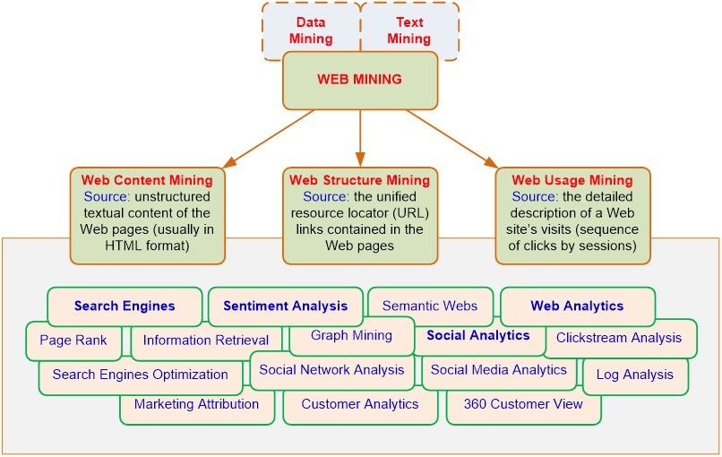
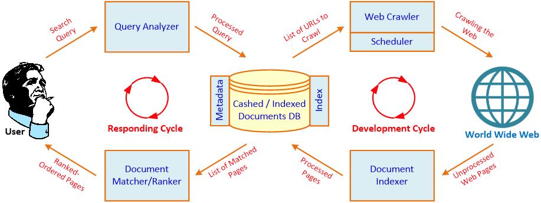

## وب کاوی چیست؟

وب کاوی زیر مجموعه متن کاوی و **داده کاوی** است. در واقع وب کاوی به فرآیند کشف روابط ذاتی میان داده های شبکه جهانی وب و بدست آوردن اطلاعات از آن‌ها گفته می شود که به طور کلی به شامل سه زیر مجموعه اصلی است:

-   **استخراج محتوای وب:** روش استخراج محتوای وب (محتوا کاوی وب) اساس کار بسیاری از موتورهای جست‌وجو است. به این صورت که شما با وارد کردن کلمات کلیدی (به صورت تک کلمه ای، چند کلمه ای و یا جمله ) شروع به جست‌وجو در می کنید. سپس موتور جست‌وجو با استفاده از کلمات کلیدی مفهوم پرس و جو شما را متوجه می شود. و در نهایت با استفاده از خزنده‌های سطح وب مطالب مورد نظر شما را، استخراج کرده و به نمایش در می آورد.
-   **استخراج ساختارهای وب:** در این بخش ساختار صفحات وب (ساختار کاوی وب) و سارختار ارجاع دادن و لینک شدن به صفحات مختلف وب مورد بررسی قرار می گیرد تا اطلاعات کاربردی مورد نظر را بتوان از سطح وب جمع آوری کرد. لینک دادن یا ارجاع دادن به سایت های دیگر بسیار رایج است. و همچنین روشی مد نظر موتور های جست‌وجو نیز هست. که با استفاده از الگوریتم های HITS یا همان hyperlink induced topic search algorithm با توجه به این لینک ورودی و خروجی در رتبه بندی صفحات تاثیر می گذارد. در کنار این موارد می توان از این کار برای استفاده از محتوای کامل و غنی دیگر وبسایت ها نیز استفاده کرد.
-   **استخراج میزان و نحوه استفاده از وب:** در این روش استفاده کاوی وب پروفایل کاربران و داده‌هایی که از بازدیدکنندگان به دست آمده و دیگر داده هایی از این قبیل، مورد بررسی قرار می گیرد. تا بتوان به اصطلاحی میزان استفاده از وب را در قالب اطلاعاتی مفید و کارآمد استخراج کرد. سپس از آنها در راستای رفع نقاط ضعف وب سایت و جذب کاربر و بازاریابی استفاده کرد.

### کاربردهای وب کاوی در موتورهای جست‌وجو

موتورهای جست‌وجوگر همانند گوگل، بینگ و بایدو مجموعه‌ای از نرم افزارها و سخت افزارها هستند که می‌توانند در یک فضای مشخص در میان حجم گسترده‌ای از داده‌ها، اطلاعات یا داده‌های مد نظر کاربران یا نرم افزارها را جست‌وجو کنند. وب کاوی با دسته بندی اسناد وب و همچنین شناسایی صفحات وب، به بهبود قدرت موتورهای جست‌وجوی وب کمک می‌کند.

در دید کلی فرآیند کاری موتورهای جست‌وجو به دو چرخه اصلی تقسیم می‌شود، چرخه توسعه و چرخه پاسخگویی. چرخه توسعه به این صورت است که یک دیتابیس اولیه‌ای از اسناد وجود دارد. با بیشتر شدن وبسایت‌ها، لیستی از آدرس صفحات مختلف آن‌ها در اختیار خزنده‌های موتورهای جست‌وجو قرار می‌گیرد. خزنده‌ها شروع به بررسی این صفحات در بستر وب می‌کنند و صفجاتی را که از قبل پردازش نشده‌اند و اطلاعات آن‌ها ثبت نشده را مشخص می‌کنند.

در گام نهایی صفحات گفته شده به بخش ایندکس کننده اسناد سپرده می‌شود. در این بخش الگوریتم‌های موتور جست‌وجو برای صفحات با توجه به اطلاعات خاصی که دارند اندیس‌هایی را در نظر می‌گیرند و این اندیس‌ها به پایگاه داده اسناد اضافه می‌شود. این روند به صورت ساعتی، روزانه و هفتگی تکرار می‌شود و این پایگاه داده دائما به‌روزرسانی می‌گردد.

چرخه دوم، چرخه پاسخگویی است. روند کاری این چرخه به این صورت است که در ابتدا کاربر برای رسیدن به اطلاعات مورد نظرش یک پرس‌وجو مطرح می‌کند. این پرس‌وجو با الگوریتم‌های پردازش زبان طبیعی مورد تجزیه و تحلیل قرار می‌گیرد تا مفهوم و هدف آن توسط ماشین درک شود. سپس با توجه به هدف پرس‌وجو به سراغ پایگاه داده اسناد می‌روند و لیستی از تمام اندیس‌های مربوط به صفحاتی دارای اطلاعات مرتبط با پرس‌وجو استخراج می‌گردد.

اما این لیست استخراج شده بسیار گسترده است و نیاز است مرتب‌سازی شود. در این بخش موتورهای جست‌وجو از الگوریتم‌هایی بسیار زیادی استفاده می‌کنند تا بتوانند بهترین صفحات را با اولویت بیشتری برای کاربران فراهم کنند و در اختیار آن‌ها بگذارند. این فرآیند برای هر پرس‌وجویی که از سوی کاربران جست‌وجو می‌شود، انجام می‌شود؛ یعنی این چرخه در طول روز هزاران بار تکرار می‌گردد.
